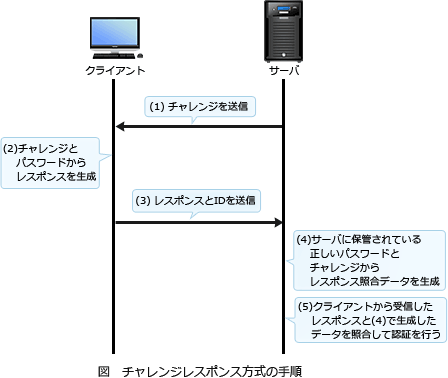

# [令和元年秋期 午前 問38](https://www.ap-siken.com/kakomon/01_aki/q38.html)

#問題 #テクノロジ #セキュリティ #情報セキュリティ

解説を表示解説を隠す

<strong>問38</strong>　チャレンジレスポンス認証方式の特徴はどれか。

<ul class="ap-choices">
<li class="ap-choice-item ap-wrong">

ア　固定パスワードをTLSによって暗号化し，クライアントからサーバに送信する。

チャレンジレスポンス方式では、固定パスワードとサーバから送信された乱数(チャレンジ)を組み合わせたものをハッシュ化又は暗号化してサーバに返信します。本肢は固定パスワードをそのまま送る方式です。

</li>
<li class="ap-choice-item ap-wrong">

イ　端末のシリアル番号を，クライアントで秘密鍵を使って暗号化してサーバに送信する。

端末のシリアル番号は送信しません。端末ごとに固有の番号を使用するといつも同じ認証データが使われることになるので、リプレイアタックを受ける可能性があります。

</li>
<li class="ap-choice-item ap-wrong">

ウ　トークンという装置が自動的に表示する，認証のたびに異なるデータをパスワードとして送信する。

これは時刻同期式<a href="用語/ワンタイムパスワード" class="internal-link" data-href="用語/ワンタイムパスワード">ワンタイムパスワード</a>の説明です。チャレンジレスポンス方式ではトークンは不要です。

</li>
<li class="ap-choice-item ap-correct">

エ　利用者が入力したパスワードと，サーバから受け取ったランダムなデータとをクライアントで演算し，その結果をサーバに送信する。

正しい。詳細：<a href="用語/チャレンジレスポンス認証" class="internal-link" data-href="用語/チャレンジレスポンス認証">チャレンジレスポンス認証</a>

</li>
</ul>

<h4>解説</h4>

チャレンジレスポンス方式は、通信経路上に固定パスワードを流さないようにすることで、<a href="用語/盗聴" class="internal-link" data-href="用語/盗聴">盗聴</a>によるパスワードの漏えいやリプレイアタックを防止する認証方式です。

チャレンジレスポンス方式では以下の手順で認証を行います。サーバは、クライアントから要求があるたびに異なる乱数値(チャレンジ)を生成して保持するとともに、クライアントへ送る。クライアントは、利用者が入力したパスワードと(1)でサーバから送られた"チャレンジ"から所定の方法でレスポンスを計算する。クライアントは、(2)で生成した"レスポンス"と利用者が入力した利用者IDをサーバに送る。サーバは、クライアントから受け取った利用者IDで利用者情報を検索して、取り出したパスワードと(1)で保持していた"チャレンジ"を用いてクライアントと同じ手順でレスポンスを生成する（レスポンス照合データ）。サーバは、"レスポンス照合データ"とクライアントから受け取った"レスポンス"を比較し、両者が一致すれば認証成功とする。したがって「エ」が正解です。

