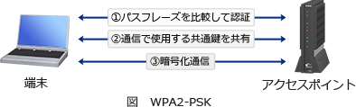

# [令和元年秋期 午前 問39](https://www.ap-siken.com/kakomon/01_aki/q39.html)

#問題 #テクノロジ #セキュリティ #セキュリティ実装技術

解説を表示解説を隠す

<strong>問39</strong>　無線LAN環境におけるWPA2-PSKの機能はどれか。

<ul class="ap-choices">
<li class="ap-choice-item ap-wrong">

ア　アクセスポイントに設定されているSSIDを共通鍵とし，通信を暗号化する。

<a href="用語/SSID" class="internal-link" data-href="用語/SSID">SSID</a>はアクセスポイントの識別子であり暗号化鍵としては使用されない。

</li>
<li class="ap-choice-item ap-correct">

イ　アクセスポイントに設定されているのと同じSSIDとパスワード(Pre-Shared Key)が設定されている端末だけに接続を許可する。

正しい。詳細：<a href="用語/WPA2" class="internal-link" data-href="用語/WPA2">WPA2</a>

</li>
<li class="ap-choice-item ap-wrong">

ウ　アクセスポイントは，IEEE 802.11acに準拠している端末だけに接続を許可する。

端末の認証はパスワードによって行われる。

</li>
<li class="ap-choice-item ap-wrong">

エ　アクセスポイントは，利用者ごとに付与されたSSIDを確認し，無線LANへのアクセス権限を識別する。

同じ<a href="用語/SSID" class="internal-link" data-href="用語/SSID">SSID</a>をもつ端末との通信制限はIEEE 802.11の機能であり、<a href="用語/WPA2" class="internal-link" data-href="用語/WPA2">WPA2</a>の機能ではない。

</li>
</ul>

<h4>解説</h4>

<a href="用語/WPA2" class="internal-link" data-href="用語/WPA2">WPA2</a>-PSK(<a href="用語/WPA2" class="internal-link" data-href="用語/WPA2">WPA2</a> Pre-Shared Key)は、無線LANの暗号化方式の規格である<a href="用語/WPA2" class="internal-link" data-href="用語/WPA2">WPA2</a>のうち個人宅やスモールオフィスなどの比較的小規模なネットワークで使用されることを想定したパーソナルモードです。このモードではアクセスポイントと端末間で事前に8文字から63文字から成るパスフレーズ(PSK:Pre-Shared Key)を共有しておき、そのパスフレーズと<a href="用語/SSID" class="internal-link" data-href="用語/SSID">SSID</a>によって端末の認証を行います。

したがって「イ」が適切です。

なお、認証にパスワードでなく<a href="用語/IEEE802.1X" class="internal-link" data-href="用語/IEEE802.1X">IEEE802.1X</a>に準拠した<a href="用語/認証サーバ" class="internal-link" data-href="用語/認証サーバ">認証サーバ</a>を使用する方式は「<a href="用語/WPA2" class="internal-link" data-href="用語/WPA2">WPA2</a> エンタープライズモード」と呼ばれます。

