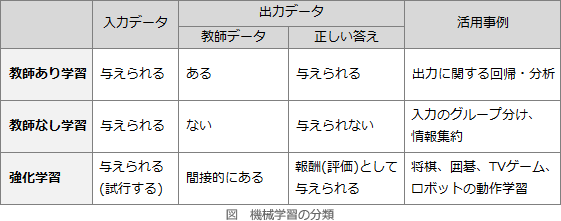

# [令和元年秋期 午前 問4](https://www.ap-siken.com/kakomon/01_aki/q4.html)

#問題 #テクノロジ #基礎理論 #情報に関する理論

解説を表示解説を隠す

<strong>問4</strong>　AIの機械学習における教師なし学習で用いられる手法として，最も適切なものはどれか。

<ul class="ap-choices">
<li class="ap-choice-item ap-wrong">

ア　幾つかのグループに分かれている既存データ間に分離境界を定め，新たなデータがどのグループに属するかはその分離境界によって判別するパターン認識手法

これは<a href="用語/教師あり学習" class="internal-link" data-href="用語/教師あり学習">教師あり学習</a>の説明です。分離境界によってデータをラベル付けし、与えられたラベルを利用して学習する手法です。

</li>
<li class="ap-choice-item ap-wrong">

イ　数式で解を求めることが難しい場合に，乱数を使って疑似データを作り，数値計算をすることによって解を推定するモンテカルロ法

<a href="用語/モンテカルロ法" class="internal-link" data-href="用語/モンテカルロ法">モンテカルロ法</a>は確率的<a href="用語/シミュレーション" class="internal-link" data-href="用語/シミュレーション">シミュレーション</a>で積分値や統計量を近似する手法であり、<a href="用語/機械学習" class="internal-link" data-href="用語/機械学習">機械学習</a>のアルゴリズムではない。

</li>
<li class="ap-choice-item ap-correct">

ウ　データ同士の類似度を定義し，その定義した類似度に従って似たもの同士は同じグループに入るようにデータをグループ化するクラスタリング

正しい。ラベルなしデータから似たもの同士を自動的にまとめ、クラスタ構造を抽出するのは<a href="用語/教師なし学習" class="internal-link" data-href="用語/教師なし学習">教師なし学習</a>の典型例です。

</li>
<li class="ap-choice-item ap-wrong">

エ　プロットされた時系列データに対して，曲線の当てはめを行い，得られた近似曲線によってデータの補完や未来予測を行う回帰分析

これは<a href="用語/回帰分析" class="internal-link" data-href="用語/回帰分析">回帰分析</a>の説明です。入力と数値出力の対応関係を学習する<a href="用語/教師あり学習" class="internal-link" data-href="用語/教師あり学習">教師あり学習</a>の手法です。

</li>
</ul>

<h4>解説</h4>

<a href="用語/機械学習" class="internal-link" data-href="用語/機械学習">機械学習</a>は、訓練データの性質によって「<a href="用語/教師あり学習" class="internal-link" data-href="用語/教師あり学習">教師あり学習</a>」「<a href="用語/教師なし学習" class="internal-link" data-href="用語/教師なし学習">教師なし学習</a>」「<a href="用語/強化学習" class="internal-link" data-href="用語/強化学習">強化学習</a>」の3つに大別できます（※<a href="用語/強化学習" class="internal-link" data-href="用語/強化学習">強化学習</a>を<a href="用語/教師なし学習" class="internal-link" data-href="用語/教師なし学習">教師なし学習</a>に含めることもあります）。

<a href="用語/教師あり学習" class="internal-link" data-href="用語/教師あり学習">教師あり学習</a>は、訓練データとしてラベル（正解）付きデータを使用する学習方法です。入力に対する正しい出力の例を与えることで、入力と出力の関係を学習させます。

<a href="用語/教師なし学習" class="internal-link" data-href="用語/教師なし学習">教師なし学習</a>は、訓練データとしてラベルなしデータを使用する学習方法です。クラスタリングなどのためにデータ構造を学習させます。

<a href="用語/強化学習" class="internal-link" data-href="用語/強化学習">強化学習</a>は、正解データの代わりに、与えられた環境における個々の行動に対して得点や報酬を与える学習方法です。一連の行動に対して評価値を与えることで、高い得点を取る、すなわち最良の行動を自律的に学習させます。

<a href="用語/教師あり学習" class="internal-link" data-href="用語/教師あり学習">教師あり学習</a>と<a href="用語/教師なし学習" class="internal-link" data-href="用語/教師なし学習">教師なし学習</a>の違いは、入力データに対する正しい答え（出力）が与えられているかどうかです。<a href="用語/教師あり学習" class="internal-link" data-href="用語/教師あり学習">教師あり学習</a>による分類では、正解となる分類先があらかじめ定義されていますが、<a href="用語/教師なし学習" class="internal-link" data-href="用語/教師なし学習">教師なし学習</a>の分類では、与えられた入力データ同士の類似度分析などを通してシステム自らがグループを定義し、グルーピングします。クラスタリングは<a href="用語/教師なし学習" class="internal-link" data-href="用語/教師なし学習">教師なし学習</a>の代表的な活用事例です。

