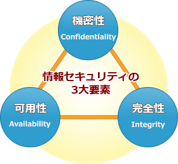

# [令和元年秋期 午前 問40](https://www.ap-siken.com/kakomon/01_aki/q40.html)

#問題 #テクノロジ #セキュリティ #情報セキュリティ管理

解説を表示解説を隠す

<strong>問40</strong>　JIS Q 27000:2019(情報セキュリティマネジメントシステム－用語)では，情報セキュリティは主に三つの特性を維持することとされている。それらのうちの二つは機密性と完全性である。残りの一つはどれか。

<ul class="ap-choices">
<li class="ap-choice-item ap-correct">

ア　可用性

正しい。詳細：<a href="用語/可用性" class="internal-link" data-href="用語/可用性">可用性</a>

</li>
<li class="ap-choice-item ap-wrong">

イ　効率性

詳細：<a href="用語/効率性" class="internal-link" data-href="用語/効率性">効率性</a>

</li>
<li class="ap-choice-item ap-wrong">

ウ　保守性

詳細：<a href="用語/保守性" class="internal-link" data-href="用語/保守性">保守性</a>

</li>
<li class="ap-choice-item ap-wrong">

エ　有効性

詳細：<a href="用語/有効性" class="internal-link" data-href="用語/有効性">有効性</a>

</li>
</ul>

<h4>解説</h4>

<a href="用語/JIS" class="internal-link" data-href="用語/JIS">JIS</a> Q 27000:2019では、<a href="用語/情報セキュリティ" class="internal-link" data-href="用語/情報セキュリティ">情報セキュリティ</a>を「情報の<a href="用語/機密性" class="internal-link" data-href="用語/機密性">機密性</a>、<a href="用語/完全性" class="internal-link" data-href="用語/完全性">完全性</a>及び<a href="用語/可用性" class="internal-link" data-href="用語/可用性">可用性</a>を維持すること」と定義しています。この定義に集約されているように、<a href="用語/情報セキュリティ" class="internal-link" data-href="用語/情報セキュリティ">情報セキュリティ</a>マネジメントにおいては、主に「<a href="用語/機密性" class="internal-link" data-href="用語/機密性">機密性</a>」「<a href="用語/完全性" class="internal-link" data-href="用語/完全性">完全性</a>」および「<a href="用語/可用性" class="internal-link" data-href="用語/可用性">可用性</a>」の3つの特性を維持・管理することが肝要です。

<a href="用語/機密性" class="internal-link" data-href="用語/機密性">機密性</a>（Confidentiality）許可された正規のユーザーだけが情報にアクセスできる特性を示す

<a href="用語/完全性" class="internal-link" data-href="用語/完全性">完全性</a>（Integrity）情報が完全で、<a href="用語/改ざん" class="internal-link" data-href="用語/改ざん">改ざん</a>・<a href="用語/破壊" class="internal-link" data-href="用語/破壊">破壊</a>されていない特性を示す

<a href="用語/可用性" class="internal-link" data-href="用語/可用性">可用性</a>（Availability）システムが正常に稼働し続けることの度合い。ユーザーが必要な時にシステムが利用可能である特性を示す

したがって残り1つは「<a href="用語/可用性" class="internal-link" data-href="用語/可用性">可用性</a>」になります。

