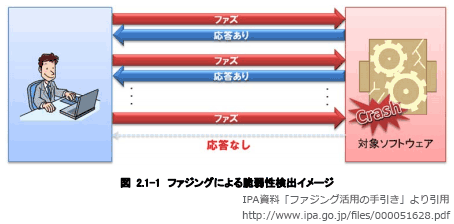

# [令和元年秋期 午前 問44](https://www.ap-siken.com/kakomon/01_aki/q44.html)

#問題 #テクノロジ #セキュリティ #セキュリティ技術評価

解説を表示解説を隠す

<strong>問44</strong>　ファジングに該当するものはどれか。

<ul class="ap-choices">
<li class="ap-choice-item ap-wrong">

ア　サーバにFINパケットを送信し，サーバからの応答を観測して，稼働しているサービスを見つけ出す。

これは<a href="用語/ポートスキャン" class="internal-link" data-href="用語/ポートスキャン">ポートスキャン</a>の説明です

</li>
<li class="ap-choice-item ap-wrong">

イ　サーバのOSやアプリケーションソフトウェアが生成したログやコマンド履歴などを解析して，ファイルサーバに保存されているファイルの改ざんを検知する。

これは<a href="用語/ログ分析" class="internal-link" data-href="用語/ログ分析">ログ分析</a>の説明です

</li>
<li class="ap-choice-item ap-correct">

ウ　ソフトウェアに，問題を引き起こしそうな多様なデータを入力し，挙動を監視して，脆弱性を見つけ出す。

正しい。詳細：<a href="用語/ファジング" class="internal-link" data-href="用語/ファジング">ファジング</a>

</li>
<li class="ap-choice-item ap-wrong">

エ　ネットワーク上を流れるパケットを収集し，そのプロトコルヘッダーやペイロードを解析して，あらかじめ登録された攻撃パターンと一致した場合は不正アクセスと判断する。

これはパターンマッチングの説明です

</li>
</ul>

<h4>解説</h4>

<a href="用語/ファジング" class="internal-link" data-href="用語/ファジング">ファジング</a>(fuzzing)とは、検査対象のソフトウェア製品に「ファズ（英名：fuzz）」と呼ばれる問題を引き起こしそうなデータを大量に送り込み、その応答や挙動を監視することで(未知の)<a href="用語/脆弱性" class="internal-link" data-href="用語/脆弱性">脆弱性</a>を検出する検査手法です。

<a href="用語/ファジング" class="internal-link" data-href="用語/ファジング">ファジング</a>は、ファズデータの生成、検査対象への送信、挙動の監視を自動で行う<a href="用語/ファジング" class="internal-link" data-href="用語/ファジング">ファジング</a>ツール(ファザー)と呼ばれるソフトウェアを使用して行います。開発ライフサイクルに<a href="用語/ファジング" class="internal-link" data-href="用語/ファジング">ファジング</a>を導入することで「バグや<a href="用語/脆弱性" class="internal-link" data-href="用語/脆弱性">脆弱性</a>の低減」「テストの自動化・効率化によるコスト削減」が期待できるため、大手企業の一部で徐々に活用され始めています。

