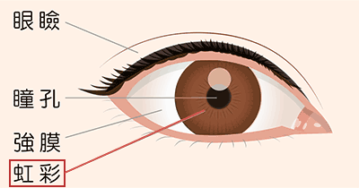

# [令和元年秋期 午前 問45](https://www.ap-siken.com/kakomon/01_aki/q45.html)

#問題 #テクノロジ #セキュリティ #情報セキュリティ対策

解説を表示解説を隠す

<strong>問45</strong>　虹彩認証に関する記述のうち，最も適切なものはどれか。

<ul class="ap-choices">
<li class="ap-choice-item ap-wrong">

ア　経年変化による認証精度の低下を防止するために，利用者の虹彩情報を定期的に登録し直さなければならない。

虹彩は満2歳以降は経年変化しないため、定期更新は不要である

</li>
<li class="ap-choice-item ap-wrong">

イ　赤外線カメラを用いると，照度を高くするほど，目に負担を掛けることなく認証精度を向上させることができる。

照度を高くすると精度は上がるが、目に負担が掛かる

</li>
<li class="ap-choice-item ap-correct">

ウ　他人受入率を顔認証と比べて低くすることが可能である。

正しい。虹彩認証は顔認証より高精度で、<a href="用語/他人受入率" class="internal-link" data-href="用語/他人受入率">他人受入率</a>を低くできる

</li>
<li class="ap-choice-item ap-wrong">

エ　本人が装置に接触したあとに残された遺留物を採取し，それを加工することによって認証データを偽造し，本人になりすますことが可能である。

非接触認証のため遺留物は残らず、指紋認証のような偽造は困難である

</li>
</ul>

<h4>解説</h4>

虹彩認証とは、眼球の特徴で本人認証を行うバイオメトリクス認証技術です。虹彩とは、眼球の黒目部分、瞳孔の外側にある円状の部分のことで、その部分のしわのパターンが個人ごとに異なることを認証に利用します。

