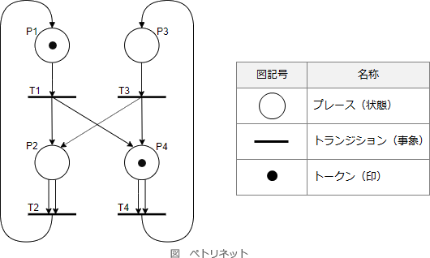

# [令和元年秋期 午前 問46](https://www.ap-siken.com/kakomon/01_aki/q46.html)

#問題 #テクノロジ #システム開発技術 #システム要件定義・ソフトウェア要件定義

解説を表示解説を隠す

<strong>問46</strong>　ソフトウェアの要求分析や設計に利用されるモデルに関する記述のうち，ペトリネットの説明として，適切なものはどれか。

<ul class="ap-choices">
<li class="ap-choice-item ap-wrong">

ア　外界の事象をデータ構造として表現する，データモデリングのアプローチをとる。その表現は，エンティティ，関連及び属性で構成される。

これは<a href="用語/E-R図" class="internal-link" data-href="用語/E-R図">E-R図</a>の説明です

</li>
<li class="ap-choice-item ap-wrong">

イ　システムの機能を入力データから出力データへの変換とみなすとともに，機能を段階的に詳細化して階層的に分割していく。

これは<a href="用語/STS分割" class="internal-link" data-href="用語/STS分割">STS分割</a>の説明です

</li>
<li class="ap-choice-item ap-wrong">

ウ　対象となる問題領域に対して，プロセスではなくオブジェクトを用いて解決を図るというアプローチをとる。

これはオブジェクト指向分析の説明です

</li>
<li class="ap-choice-item ap-correct">

エ　並行して進行する事象間の同期を表す。その構造はプレースとトランジションという2種類の節点をもつ有向2部グラフで表される。

正しい。詳細：<a href="用語/ペトリネットモデル" class="internal-link" data-href="用語/ペトリネットモデル">ペトリネットモデル</a>

</li>
</ul>

<h4>解説</h4>

ペトリネット(Petri Net)は、プレース、トランジション、トークンの3つの要素を使用した<a href="用語/有向グラフ" class="internal-link" data-href="用語/有向グラフ">有向グラフ</a>でシステムの動作を記述する図法です。並行する処理同士の<a href="用語/制御の流れ" class="internal-link" data-href="用語/制御の流れ">制御の流れ</a>や<a href="用語/同期" class="internal-link" data-href="用語/同期">同期</a>のタイミングを分析・設計するために用いられます。トランジションは入力プレースと出力プレースに連結され、プレースがトークンをもつとき条件を満たしていることを表します。入力プレースのトークンが所定数に達するとトランジションが発火し、トークンは入力プレースから出力プレースに移動します。このようにペトリネットでは、トークンの流れや処理の連鎖によってシステムの動作を分析します。

