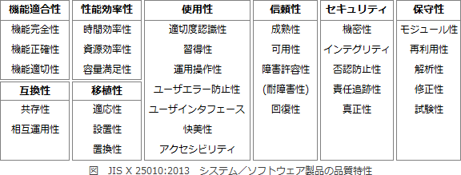

# [令和元年秋期 午前 問47](https://www.ap-siken.com/kakomon/01_aki/q47.html)

#問題 #テクノロジ #システム開発技術 #設計

解説を表示解説を隠す

<strong>問47</strong>　JIS X 25010:2013(システム及びソフトウェア製品の品質要求及び評価(SQuaRE)－システム及びソフトウェア品質モデル)で規定されたシステム及びソフトウェア製品の品質特性の一つである"機能適合性"の説明はどれか。

<ul class="ap-choices">
<li class="ap-choice-item ap-wrong">

ア　同じハードウェア環境又はソフトウェア環境を共有する間，製品，システム又は構成要素が他の製品，システム又は構成要素の情報を交換することができる度合い，及び／又はその要求された機能を実行することができる度合い

これは<a href="用語/互換性" class="internal-link" data-href="用語/互換性">互換性</a>の説明です

</li>
<li class="ap-choice-item ap-wrong">

イ　人間又は他の製品若しくはシステムが，認められた権限の種類及び水準に応じたデータアクセスの度合いをもてるように，製品又はシステムが情報及びデータを保護する度合い

これは<a href="用語/セキュリティ" class="internal-link" data-href="用語/セキュリティ">セキュリティ</a>の説明です

</li>
<li class="ap-choice-item ap-wrong">

ウ　明示された時間帯で，明示された条件下に，システム，製品又は構成要素が明示された機能を実行する度合い

これは<a href="用語/信頼性" class="internal-link" data-href="用語/信頼性">信頼性</a>の説明です

</li>
<li class="ap-choice-item ap-correct">

エ　明示された状況下で使用するとき，明示的ニーズ及び暗黙のニーズを満足させる機能を，製品又はシステムが提供する度合い

正しい。詳細：<a href="用語/機能適合性" class="internal-link" data-href="用語/機能適合性">機能適合性</a>

</li>
</ul>

<h4>解説</h4>

<a href="用語/JIS X 25010" class="internal-link" data-href="用語/JIS X 25010">JIS X 25010</a>:2013は、システム及びソフトウェア製品の品質を評価する基準で、ISO/IEC 25010を基にJIS X 0129の後継規格として標準化されたものです。<a href="用語/JIS X 25010" class="internal-link" data-href="用語/JIS X 25010">JIS X 25010</a>:2013では品質モデルの枠組みが「利用時の品質モデル」と「システム／ソフトウェア製品品質」に分割されています。従来のJIS X 0129ではシステム／ソフトウェア製品品質として6つ在った<a href="用語/品質特性" class="internal-link" data-href="用語/品質特性">品質特性</a>は「8つ」に拡大され、<a href="用語/品質特性" class="internal-link" data-href="用語/品質特性">品質特性</a>を細分化した副特性も21個から「32個」に増えています。以下の表は<a href="用語/JIS X 25010" class="internal-link" data-href="用語/JIS X 25010">JIS X 25010</a>版のシステム／ソフトウェア製品品質に定義されている品質(副)特性の一覧です。

各<a href="用語/品質特性" class="internal-link" data-href="用語/品質特性">品質特性</a>は規格内で以下のように定義されています。副特性について知りたい方は参考URL等のJIS規格を参照ください。

<a href="用語/機能適合性" class="internal-link" data-href="用語/機能適合性">機能適合性</a>(functional suitability)：明示された状況下で使用するとき，明示的ニーズ及び暗黙のニーズを満足させる機能を，製品又はシステムが提供する度合い

<a href="用語/性能効率性" class="internal-link" data-href="用語/性能効率性">性能効率性</a>(performance efficiency)：明記された状態（条件）で使用する資源の量に関係する性能の度合い

<a href="用語/互換性" class="internal-link" data-href="用語/互換性">互換性</a>(compatibility)：同じハードウェア環境又はソフトウェア環境を共有する間，製品，システム又は構成要素が他の製品，システム又は構成要素の情報を交換することができる度合い，及び／又はその要求された機能を実行することができる度合い

<a href="用語/使用性" class="internal-link" data-href="用語/使用性">使用性</a>(usability)：明示された利用状況において，<a href="用語/有効性" class="internal-link" data-href="用語/有効性">有効性</a>，<a href="用語/効率性" class="internal-link" data-href="用語/効率性">効率性</a>及び<a href="用語/満足性" class="internal-link" data-href="用語/満足性">満足性</a>をもって明示された目標を達成するために，明示された利用者が製品又はシステムを利用することができる度合い

<a href="用語/信頼性" class="internal-link" data-href="用語/信頼性">信頼性</a>(reliability)：明示された時間帯で，明示された条件下に，システム，製品又は構成要素が明示された機能を実行する度合い

<a href="用語/セキュリティ" class="internal-link" data-href="用語/セキュリティ">セキュリティ</a>(security)：人間又は他の製品若しくはシステムが，認められた権限の種類及び水準に応じたデータアクセスの度合いをもてるように，製品又はシステムが情報及びデータを保護する度合い

<a href="用語/保守性" class="internal-link" data-href="用語/保守性">保守性</a>(maintainability)：意図した保守者によって，製品又はシステムが修正することができる<a href="用語/有効性" class="internal-link" data-href="用語/有効性">有効性</a>及び<a href="用語/効率性" class="internal-link" data-href="用語/効率性">効率性</a>の度合い

<a href="用語/移植性" class="internal-link" data-href="用語/移植性">移植性</a>(portability)：一つのハードウェア，ソフトウェア又は他の運用環境若しくは利用環境からその他の環境に，システム，製品又は構成要素を移すことができる<a href="用語/有効性" class="internal-link" data-href="用語/有効性">有効性</a>及び<a href="用語/効率性" class="internal-link" data-href="用語/効率性">効率性</a>の度合い

