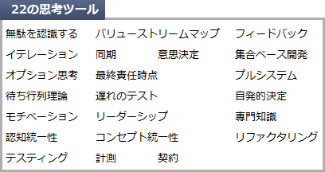

# [令和元年秋期 午前 問49](https://www.ap-siken.com/kakomon/01_aki/q49.html)

#問題 #テクノロジ #ソフトウェア開発管理技術 #開発プロセス・手法

解説を表示解説を隠す

<strong>問49</strong>　(1)～(7)に示した七つの原則を適用して，アジャイル開発プラクティスを実践する考え方はどれか。 (1) ムダをなくす (2) 品質を作り込む (3) 知識を作り出す (4) 決定を遅らせる (5) 早く提供する (6) 人を尊重する (7) 全体を最適化する

<ul class="ap-choices">
<li class="ap-choice-item ap-wrong">

ア　エクストリームプログラミング

詳細：<a href="用語/XP" class="internal-link" data-href="用語/XP">XP</a>

</li>
<li class="ap-choice-item ap-wrong">

イ　スクラム

詳細：<a href="用語/スクラム" class="internal-link" data-href="用語/スクラム">スクラム</a>

</li>
<li class="ap-choice-item ap-wrong">

ウ　フィーチャ駆動型開発

詳細：<a href="用語/ユーザー機能駆動開発" class="internal-link" data-href="用語/ユーザー機能駆動開発">ユーザー機能駆動開発</a>

</li>
<li class="ap-choice-item ap-correct">

エ　リーンソフトウェア開発

正しい。詳細：<a href="用語/リーンソフトウェア開発" class="internal-link" data-href="用語/リーンソフトウェア開発">リーンソフトウェア開発</a>

</li>
</ul>

<h4>解説</h4>

<a href="用語/リーンソフトウェア開発" class="internal-link" data-href="用語/リーンソフトウェア開発">リーンソフトウェア開発</a>は、トヨタ<a href="用語/生産方式" class="internal-link" data-href="用語/生産方式">生産方式</a>が生んだ「7つのムダ」の基本理念を発展させたリーン<a href="用語/生産方式" class="internal-link" data-href="用語/生産方式">生産方式</a>を、ソフトウェア開発に適用した手法です。ソフトウェア開発に潜むムラ(ばらつき)・ムリ(不合理・過負荷)・ムダ(<a href="用語/付加価値" class="internal-link" data-href="用語/付加価値">付加価値</a>のない作業)を排除することを中核に据え、生産効率と品質の最適化を追求することを目的としています。リーン(lean)は、痩せていて脂肪のないこと、無駄がなく引き締まっていることなどを意味します。

<a href="用語/リーンソフトウェア開発" class="internal-link" data-href="用語/リーンソフトウェア開発">リーンソフトウェア開発</a>を支える「7つの原則」は次の通りです。 (1) ムダをなくす (2) 品質を作り込む (3) 知識を作り出す (4) 決定を遅らせる (5) 速く提供する (6) 人を尊重する (7) 全体を最適化する さらに、これらを実現するための「22の思考ツール」が挙げられています。したがって「エ」が正解です。

ア：エクストリームプログラミング(<a href="用語/XP" class="internal-link" data-href="用語/XP">XP</a>)は、プログラム中心の<a href="用語/アジャイル" class="internal-link" data-href="用語/アジャイル">アジャイル</a>開発の<a href="用語/フレームワーク" class="internal-link" data-href="用語/フレームワーク">フレームワーク</a>で4分類、19のプラクティスを適用します。 イ：<a href="用語/スクラム" class="internal-link" data-href="用語/スクラム">スクラム</a>は、<a href="用語/アジャイル" class="internal-link" data-href="用語/アジャイル">アジャイル</a>開発の方法論の1つで、開発プロジェクトを数週間程度の短期間ごとに区切り、その期間内に分析、設計、実装、テストの一連の活動を行い、一部分の機能を完成させるという作業を繰り返しながら、段階的に動作可能なシステムを作り上げる<a href="用語/フレームワーク" class="internal-link" data-href="用語/フレームワーク">フレームワーク</a>です。 ウ：フィーチャ駆動型開発(FDD)は、ユーザーにとって価値のある小さな機能のかたまり(フィーチャ)を単位として、実際に動作するソフトウェアを短期反復的に開発し、徐々に完成に近づけていく<a href="用語/アジャイル" class="internal-link" data-href="用語/アジャイル">アジャイル</a>開発の<a href="用語/フレームワーク" class="internal-link" data-href="用語/フレームワーク">フレームワーク</a>です。5つのプロセス、8つのプラクティスが定義されています。 エ：正しい。<a href="用語/リーンソフトウェア開発" class="internal-link" data-href="用語/リーンソフトウェア開発">リーンソフトウェア開発</a>は、7つの原則を適用する<a href="用語/アジャイル" class="internal-link" data-href="用語/アジャイル">アジャイル</a>開発の<a href="用語/フレームワーク" class="internal-link" data-href="用語/フレームワーク">フレームワーク</a>です。

