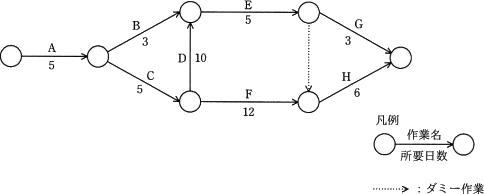

# [令和元年秋期 午前 問52](https://www.ap-siken.com/kakomon/01_aki/q52.html)

#問題 #マネジメント #プロジェクトマネジメント #プロジェクトの時間

解説を表示解説を隠す

<strong>問52</strong>　アローダイアグラムで表される作業A～Hを見直したところ，作業Dだけが短縮可能であり，その所要日数は6日間に短縮できることが分かった。作業全体の所要日数は何日間短縮できるか。 

<ul class="ap-choices">
<li class="ap-choice-item ap-wrong">

ア　1

短縮後のパス所要日数（27日と28日）の差を、全体の短縮日数と誤認している

</li>
<li class="ap-choice-item ap-wrong">

イ　2

短縮前後の最短所要日数の差の計算を誤った場合

</li>
<li class="ap-choice-item ap-correct">

ウ　3

正しい。短縮前後の最短所要日数の差（31日−28日＝3日）が全体の短縮日数である

</li>
<li class="ap-choice-item ap-wrong">

エ　4

作業Dの短縮日数（10日−6日＝4日）をそのまま全体の短縮日数とした（<a href="用語/クリティカルパス" class="internal-link" data-href="用語/クリティカルパス">クリティカルパス</a>の移行を見落とした）

</li>
</ul>

<h4>解説</h4>

<a href="用語/アローダイアグラム" class="internal-link" data-href="用語/アローダイアグラム">アローダイアグラム</a>の定番問題です。

まず、作業D短縮前の図における<a href="用語/クリティカルパス" class="internal-link" data-href="用語/クリティカルパス">クリティカルパス</a>を求めます。※ダミー作業は作業日数0日の作業として計算します。

<ul>
<li>A→B→E→G　5＋3＋5＋3＝16日</li>
<li>A→B→E→(ダミー)→H　5＋3＋5＋0＋6＝19日</li>
<li>A→C→D→E→G　5＋5＋10＋5＋3＝28日</li>
<li>A→C→D→E→(ダミー)→H　5＋5＋10＋5＋0＋6＝31日</li>
<li>A→C→F→H　5＋5＋12＋6＝28日</li>
</ul>

以上の計算から<a href="用語/クリティカルパス" class="internal-link" data-href="用語/クリティカルパス">クリティカルパス</a>は「A→C→D→E→(ダミー)→H」、最短所要日数は「31日」であることがわかります。

次に、作業Dの作業日数が10日間から6日間に短縮された場合ですが、作業Dを含む2つのパスについて所要日数が以下のように変化します。

<ul>
<li>A→C→D→E→G　5＋5＋6＋5＋3＝24日</li>
<li>A→C→D→E→(ダミー)→H　5＋5＋6＋5＋0＋6＝27日</li>
</ul>

作業短縮前の<a href="用語/クリティカルパス" class="internal-link" data-href="用語/クリティカルパス">クリティカルパス</a>である「A→C→D→E→(ダミー)→H」の所要日数が27日に短縮されるので、短縮後の<a href="用語/アローダイアグラム" class="internal-link" data-href="用語/アローダイアグラム">アローダイアグラム</a>における<a href="用語/クリティカルパス" class="internal-link" data-href="用語/クリティカルパス">クリティカルパス</a>は、より所要日数の長い「A→C→F→H（28日間）」に移ります。

短縮前後の最短所要日数の差は「31日−28日＝3日」ですので、作業全体の短縮日数は「3日」となります。

