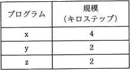
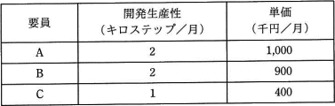

# [令和元年秋期 午前 問54](https://www.ap-siken.com/kakomon/01_aki/q54.html)

#問題 #マネジメント #プロジェクトマネジメント #プロジェクトの品質

解説を表示解説を隠す

<strong>問54</strong>　プログラムx，y，zの開発を2か月以内に完了したい。外部から調達可能な要員はA，B，Cの3名であり，開発生産性と単価が異なる。このプログラム群を開発する最小のコストは，何千円か。ここで，各プログラムの開発は，それぞれ1名が担当し，要員は開発生産性どおりの効率で開発できるものとする。また，それぞれの要員は，担当したプログラムの開発が完了する時点までの契約とする。  〔プログラムの規模〕 〔要員の開発生産性と単価〕  

<ul class="ap-choices">
<li class="ap-choice-item ap-wrong">

ア　3,200

2カ月以内・最小コストの割当てでは得られない値です。

</li>
<li class="ap-choice-item ap-wrong">

イ　3,400

2カ月以内・最小コストの割当てでは得られない値です。

</li>
<li class="ap-choice-item ap-correct">

ウ　3,600

正しい。Aさん1カ月、Bさん2カ月、Cさん2カ月の<a href="用語/契約" class="internal-link" data-href="用語/契約">契約</a>で3,600千円。

</li>
<li class="ap-choice-item ap-wrong">

エ　3,700

プログラムxを単価の高いAさんに担当させた場合などに得られる値で、最小ではありません。

</li>
</ul>

<h4>解説</h4>

各<a href="用語/要員" class="internal-link" data-href="用語/要員">要員</a>のキロステップ当たりの単価は、以下のとおりです。 Aさん … 1,000÷2＝500 Bさん … 900÷2＝450 Cさん … 400÷1＝400 コスト面を考えると<a href="用語/調達" class="internal-link" data-href="用語/調達">調達</a>の優先度は、Cさん→Bさん→Aさんの順になります。

まず規模4キロステップのプログラムxですが、各プログラムの担当者は1人という制約があるので、2カ月で完成させるには1カ月に2キロステップ開発できるAさんまたはBさんに担当してもらうしかありません。単価はBさんの方が安いので、プログラムxの担当はBさんになります。

次にプログラムyとzですが、AさんとCさんのどちらの担当でも構いません。Cさんは2カ月<a href="用語/契約" class="internal-link" data-href="用語/契約">契約</a>で2キロステップ、Aさんは1カ月<a href="用語/契約" class="internal-link" data-href="用語/契約">契約</a>で2キロステップ開発してもらえば、全てのプログラムを2カ月で完成することができます。

<a href="用語/要員" class="internal-link" data-href="用語/要員">要員</a>と<a href="用語/契約" class="internal-link" data-href="用語/契約">契約</a>月数はそれぞれ、Aさん：1カ月、Bさん：2カ月、Cさん：2カ月となるので、<a href="用語/調達" class="internal-link" data-href="用語/調達">調達</a>コストは、 1,000×1＋900×2＋400×2＝3,600千円 したがって「ウ」が正解です。

