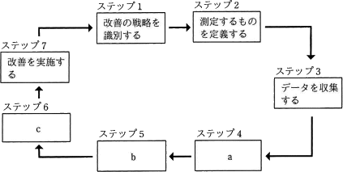
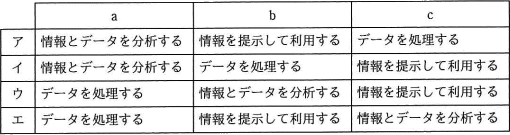

# [令和元年秋期 午前 問56](https://www.ap-siken.com/kakomon/01_aki/q56.html)

#問題 #マネジメント #サービスマネジメント

解説を表示解説を隠す

<strong>問56</strong>　ITIL 2011 editionによれば， 7ステップの改善プロセスにおけるa，b及びcの適切な組合せはどれか。  〔7ステップの改善プロセス〕  

<ul class="ap-choices">
<li class="ap-choice-item ap-wrong">

ア

a＝情報とデータを分析する、となっており、④処理に対応しません。

</li>
<li class="ap-choice-item ap-wrong">

イ

a＝情報とデータを分析する、b＝データを処理する、となっており、④処理と⑤分析の順と一致しません。

</li>
<li class="ap-choice-item ap-correct">

ウ

正しい。④処理→データを処理する、⑤分析→情報とデータを分析する、⑥提示→情報を提示して利用する、に対応します。

</li>
<li class="ap-choice-item ap-wrong">

エ

b＝情報を提示して利用する、c＝情報とデータを分析する、となっており、⑤分析と⑥提示の順と一致しません。

</li>
</ul>

<h4>解説</h4>

<a href="用語/ITIL" class="internal-link" data-href="用語/ITIL">ITIL</a> 2011 editionに記載されている「7ステップの改善プロセス」とは、改善を①特定、②定義、③収集、④処理、⑤分析、⑥提示、⑦実装するために必要な手順を定義および管理するプロセスのことです。

設問では、ステップ4の処理、ステップ5の分析、ステップ6の提示が空欄になっているので、それぞれに該当する作業を当てはめます。

<ul>
<li>④処理 → データを処理する</li>
<li>⑤分析 → 情報とデータを分析する</li>
<li>⑥提示 → 情報を提示して利用する</li>
</ul>

と対応するので、正しい組合せは「ウ」となります。

