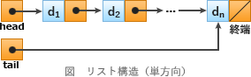

# [令和元年秋期 午前 問6](https://www.ap-siken.com/kakomon/01_aki/q6.html)

#問題 #テクノロジ #アルゴリズムとプログラミング #データ構造

解説を表示解説を隠す

<strong>問6</strong>　先頭ポインタと末尾ポインタをもち，多くのデータがポインタでつながった単方向の線形リストの処理のうち，先頭ポインタ，末尾ポインタ又は各データのポインタをたどる回数が最も多いものはどれか。ここで，単方向のリストは先頭ポインタからつながっているものとし，追加するデータはポインタをたどらなくても参照できるものとする。

<ul class="ap-choices">
<li class="ap-choice-item ap-wrong">

ア　先頭にデータを追加する処理

追加するデータの次ノードポインタに現在の先頭ポインタの値を設定し、先頭ポインタを追加データに付け替えるだけで、ポインタをたどる回数は0回です。

</li>
<li class="ap-choice-item ap-wrong">

イ　先頭のデータを削除する処理

先頭ポインタをたどって先頭データを参照し、先頭ポインタを次ノードに付け替えるだけで、たどる回数は1回です。

</li>
<li class="ap-choice-item ap-wrong">

ウ　末尾にデータを追加する処理

末尾ポインタをたどって末尾データを参照し、次ノードと末尾ポインタを更新するだけで、たどる回数は1回です。

</li>
<li class="ap-choice-item ap-correct">

エ　末尾のデータを削除する処理

正しい。<a href="用語/単方向リスト" class="internal-link" data-href="用語/単方向リスト">単方向リスト</a>では前のノードに遡れないため、先頭から末尾の一つ前までポインタをたどる必要があります。

</li>
</ul>

<h4>解説</h4>

<a href="用語/リスト" class="internal-link" data-href="用語/リスト">リスト</a>構造は、隣接するデータ同士をポインタで連結して表現する<a href="用語/データ構造" class="internal-link" data-href="用語/データ構造">データ構造</a>です。

アについて

<ol>
<li>追加するデータの次ノードポインタに、現在の先頭ポインタの値を設定</li>
<li>先頭ポインタに、追加するデータを指すポインタを設定</li>
</ol>

よって、ポインタをたどる回数は0回です。

イについて

<ol>
<li>先頭ポインタをたどって先頭データを参照</li>
<li>先頭ポインタに、先頭データが持つ次ノードポインタの値を設定</li>
</ol>

よって、ポインタをたどる回数は「先頭ポインタ→先頭データ」で1回です。

ウについて

<ol>
<li>末尾ポインタをたどって末尾データを参照</li>
<li>末尾データの次ノードポインタに、追加するデータを指すポインタを設定</li>
<li>末尾ポインタに、追加するデータを指すポインタを設定</li>
</ol>

よって、ポインタをたどる回数は「末尾ポインタ→末尾データ」で1回です。

エについて 正しい。末尾のデータを削除するには、末尾の一つ前のデータの次ノードポインタを空にして、末尾ポインタに末尾の一つ前のデータを指すポインタを設定しなくてはなりません。<a href="用語/単方向リスト" class="internal-link" data-href="用語/単方向リスト">単方向リスト</a>では、末尾のデータから前のデータに遡ることはできないので、先頭から末尾の一つ前まで順番にポインタをたどっていく必要があります。 つまり「末尾のデータを削除する処理」の場合、ポインタをたどる回数は<a href="用語/リスト" class="internal-link" data-href="用語/リスト">リスト</a>が保持するデータ数にほぼ等しい回数となり、「エ」以外の処理と比較してポインタをたどる回数が極端に多くなることがわかります。

したがって「エ」が正解です。

