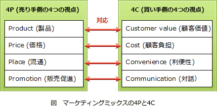

# [令和元年秋期 午前 問68](https://www.ap-siken.com/kakomon/01_aki/q68.html)

#問題 #ストラテジ #経営戦略マネジメント #マーケティング

解説を表示解説を隠す

<strong>問68</strong>　売手側でのマーケティング要素4Pは，買手側での要素4Cに対応するという考え方がある。4Pの一つであるプロモーションに対応する4Cの構成要素はどれか。

<ul class="ap-choices">
<li class="ap-choice-item ap-wrong">

ア　顧客価値(Customer Value)

製品（Product）に対応する4Cの要素です。

</li>
<li class="ap-choice-item ap-wrong">

イ　顧客コスト(Customer Cost)

価格（Price）に対応する4Cの要素です。

</li>
<li class="ap-choice-item ap-correct">

ウ　コミュニケーション(Communication)

正しい。プロモーション（Promotion）に対応する4Cの要素です。

</li>
<li class="ap-choice-item ap-wrong">

エ　利便性(Convenience)

流通（Place）に対応する4Cの要素です。

</li>
</ul>

<h4>解説</h4>

売手側での<a href="用語/マーケティングの4P" class="internal-link" data-href="用語/マーケティングの4P">マーケティングの4P</a>とは次の4つです。

Product（製品、サービス、品質） Price（価格、割引、コスパ） Place（流通、立地、流通範囲、品揃え） Promotion（販売促進、宣伝、広告）

4Pとは逆に、買手側の視点である<a href="用語/マーケティングの4C" class="internal-link" data-href="用語/マーケティングの4C">マーケティングの4C</a>は次の4つです。

Customer value（<a href="用語/顧客価値" class="internal-link" data-href="用語/顧客価値">顧客価値</a>） Customer cost（顧客コスト） Convenience（利便性） Communication（コミュニケーション・対話）

<a href="用語/マーケティングの4P" class="internal-link" data-href="用語/マーケティングの4P">マーケティングの4P</a>と<a href="用語/マーケティングの4C" class="internal-link" data-href="用語/マーケティングの4C">マーケティングの4C</a>はそれぞれ次のように対応しています。

<a href="用語/マーケティングの4P" class="internal-link" data-href="用語/マーケティングの4P">マーケティングの4P</a>のプロモーションに対応する<a href="用語/マーケティングの4C" class="internal-link" data-href="用語/マーケティングの4C">マーケティングの4C</a>の要素は「コミュニケーション」です。したがって「ウ」が正解となります。

