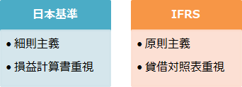

# [令和元年秋期 午前 問76](https://www.ap-siken.com/kakomon/01_aki/q76.html)

#問題 #ストラテジ #企業活動 #会計・財務

解説を表示解説を隠す

<strong>問76</strong>　国際的な標準として取り決められた会計基準などの総称であり，資本市場の国際化に対し，利害関係者からみた会計情報の比較可能性や均質性を担保するものはどれか。

<ul class="ap-choices">
<li class="ap-choice-item ap-wrong">

ア　GAAP

詳細：GAAP

</li>
<li class="ap-choice-item ap-wrong">

イ　IASB

詳細：IASB

</li>
<li class="ap-choice-item ap-correct">

ウ　IFRS

正しい。詳細：<a href="用語/IFRS" class="internal-link" data-href="用語/IFRS">IFRS</a>

</li>
<li class="ap-choice-item ap-wrong">

エ　SEC

詳細：SEC

</li>
</ul>

<h4>解説</h4>

<a href="用語/IFRS" class="internal-link" data-href="用語/IFRS">IFRS</a>(International Financial Reporting Standards，国際財務会計報告基準)は、独立民間非営利の基準設定機関であるIASBが世界共通で利用できる<a href="用語/会計基準" class="internal-link" data-href="用語/会計基準">会計基準</a>を目指して設定している基準であり、2017年現在、オーストラリアやカナダ、ユーロ圏、韓国など世界110か国以上で利用されています。

グローバル化に伴い世界の様々な国々でも<a href="用語/会計基準" class="internal-link" data-href="用語/会計基準">会計基準</a>に<a href="用語/IFRS" class="internal-link" data-href="用語/IFRS">IFRS</a>を適用する動きが活発になっていて、日本でも上場企業に対して2015年または2016年期での適用が予定されていましたが、震災の影響や対応遅れにより適用時期が未定となっています。強制適用前の日本ですが、任意適用(予定を含む)企業が200社を超えるなど徐々に浸透してきています。

したがって「ウ」が正解です。

