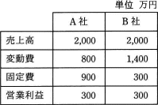

# [令和元年秋期 午前 問77](https://www.ap-siken.com/kakomon/01_aki/q77.html)

#問題 #ストラテジ #企業活動 #会計・財務

解説を表示解説を隠す

<strong>問77</strong>　損益分岐点分析でA社とB社を比較した記述のうち，適切なものはどれか。 

<ul class="ap-choices">
<li class="ap-choice-item ap-correct">

ア　安全余裕率はB社の方が高い。

正しい。安全余裕率はA社25%、B社50%なので、B社の方が高い。

</li>
<li class="ap-choice-item ap-wrong">

イ　売上高が両社とも3,000万円である場合，営業利益はB社の方が高い。

売上高3,000万円のときの営業利益はA社900、B社600なので、A社の方が高い。

</li>
<li class="ap-choice-item ap-wrong">

ウ　限界利益率はB社の方が高い。

限界利益率はA社60%、B社30%なので、A社の方が高い。

</li>
<li class="ap-choice-item ap-wrong">

エ　損益分岐点売上高はB社の方が高い。

<a href="用語/損益分岐点" class="internal-link" data-href="用語/損益分岐点">損益分岐点</a>売上高はA社1,500、B社1,000なので、A社の方が高い。

</li>
</ul>

<h4>解説</h4>

<a href="用語/損益分岐点" class="internal-link" data-href="用語/損益分岐点">損益分岐点</a>分析で使用される主な指標とその計算式は以下の通りです。

<strong><a href="用語/損益分岐点" class="internal-link" data-href="用語/損益分岐点">損益分岐点</a>売上高</strong> 売上高と<a href="用語/費用" class="internal-link" data-href="用語/費用">費用</a>の合計が等しく利益が0となる売上高を示す。 ●固定費÷(1－変動費率)

<strong><a href="用語/損益分岐点" class="internal-link" data-href="用語/損益分岐点">損益分岐点</a>比率</strong> 実際の売上高に対する<a href="用語/損益分岐点" class="internal-link" data-href="用語/損益分岐点">損益分岐点</a>の割合を示し、この値が低いほど収益性が高く、かつ売上減少に耐える力が強いことを意味する。 ●<a href="用語/損益分岐点" class="internal-link" data-href="用語/損益分岐点">損益分岐点</a>売上高÷売上高×100

<strong>安全余裕率</strong> 実際の売上高と<a href="用語/損益分岐点" class="internal-link" data-href="用語/損益分岐点">損益分岐点</a>の差がどれくらいあるかを示し、この値が高いほど経営に余裕があることを意味する。 ●(売上高－<a href="用語/損益分岐点" class="internal-link" data-href="用語/損益分岐点">損益分岐点</a>売上高)÷売上高×100

<strong>限界利益率</strong> 売上高に対する限界利益の割合を示す。 ●(売上高－変動費)÷売上高×100

これを踏まえて各記述の正誤を判断していきますが、前提として両者の<a href="用語/損益分岐点" class="internal-link" data-href="用語/損益分岐点">損益分岐点</a>売上高だけは先に求めておきます。

[A社] 変動費率＝800÷2,000＝0.4 <a href="用語/損益分岐点" class="internal-link" data-href="用語/損益分岐点">損益分岐点</a>売上高＝900÷(1－0.4)＝1,500

[B社] 変動費率＝1,400÷2,000＝0.7 <a href="用語/損益分岐点" class="internal-link" data-href="用語/損益分岐点">損益分岐点</a>売上高＝300÷(1－0.7)＝1,000

<strong>ア</strong> 正しい。 [A社] (2,000－1,500)÷2,000＝500÷2,000＝0.25＝25% [B社] (2,000－1,000)÷2,000＝1,000÷2,000＝0.5＝50% 安全余裕率は「A社＜B社」ですので記述は適切です。

<strong>イ</strong> 売上高から変動費と固定費を差し引いた金額が利益です。変動費は「売上高×変動費率」で計算します。 [A社] 3,000－(3,000×0.4)－900＝3,000－1,200－900＝900 [B社] 3,000－(3,000×0.7)－300＝3,000－2,100－300＝600 売上高が3,000万円のときの営業利益は「A社＞B社」ですので記述は誤りです。

<strong>ウ</strong> [A社] (2,000－800)÷2,000＝1,200÷2,000＝0.6＝60% [B社] (2,000－1,400)÷2,000＝600÷2,000＝0.3＝30% 限界利益率は「A社＞B社」ですので記述は誤りです。

<strong>エ</strong> <a href="用語/損益分岐点" class="internal-link" data-href="用語/損益分岐点">損益分岐点</a>売上高は「A社＞B社」ですので記述は誤りです。

