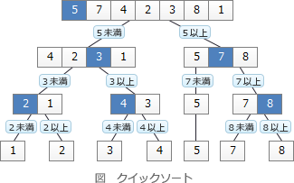

# [令和元年秋期 午前 問8](https://www.ap-siken.com/kakomon/01_aki/q8.html)

#問題 #テクノロジ #アルゴリズムとプログラミング #アルゴリズム

解説を表示解説を隠す

<strong>問8</strong>　分割統治を利用した整列法はどれか。

<ul class="ap-choices">
<li class="ap-choice-item ap-wrong">

ア　基数ソート

<a href="用語/分割統治法" class="internal-link" data-href="用語/分割統治法">分割統治法</a>ではない。

</li>
<li class="ap-choice-item ap-correct">

イ　クイックソート

正しい。詳細：<a href="用語/クイックソート" class="internal-link" data-href="用語/クイックソート">クイックソート</a>

</li>
<li class="ap-choice-item ap-wrong">

ウ　選択ソート

詳細：<a href="用語/選択ソート" class="internal-link" data-href="用語/選択ソート">選択ソート</a>

</li>
<li class="ap-choice-item ap-wrong">

エ　挿入ソート

詳細：<a href="用語/挿入ソート" class="internal-link" data-href="用語/挿入ソート">挿入ソート</a>

</li>
</ul>

<h4>解説</h4>

<a href="用語/分割統治法" class="internal-link" data-href="用語/分割統治法">分割統治法</a>は、大きな問題を同じ構造をもつ複数の小さな問題に分割し、その小さな問題の解を統合することで最終的に元の大きな問題を解決しようとする考え方です。

<a href="用語/クイックソート" class="internal-link" data-href="用語/クイックソート">クイックソート</a>は、整列対象のデータ群をある基準値以下のグループと基準値以上のグループに分割し、さらに分割後の各グループで基準値を選んで二つのグループに分割するという処理を繰り返してデータを整列する<a href="用語/アルゴリズム" class="internal-link" data-href="用語/アルゴリズム">アルゴリズム</a>です。下図のように全体を小集団に分けながら整列を行うので、分割統治型の整列法と言えます。 

なお、データ整列方法は「逐次添加法」「<a href="用語/分割統治法" class="internal-link" data-href="用語/分割統治法">分割統治法</a>」「<a href="用語/データ構造" class="internal-link" data-href="用語/データ構造">データ構造</a>の利用」などの種類に分類されます。

逐次添加法：<a href="用語/バブルソート" class="internal-link" data-href="用語/バブルソート">バブルソート</a>、基本選択法、基本挿入法 <a href="用語/分割統治法" class="internal-link" data-href="用語/分割統治法">分割統治法</a>：<a href="用語/クイックソート" class="internal-link" data-href="用語/クイックソート">クイックソート</a>、<a href="用語/マージソート" class="internal-link" data-href="用語/マージソート">マージソート</a>、<a href="用語/シェルソート" class="internal-link" data-href="用語/シェルソート">シェルソート</a> <a href="用語/データ構造" class="internal-link" data-href="用語/データ構造">データ構造</a>の利用：<a href="用語/ヒープソート" class="internal-link" data-href="用語/ヒープソート">ヒープソート</a>、<a href="用語/2分探索木" class="internal-link" data-href="用語/2分探索木">2分探索木</a>

