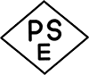

# [令和元年秋期 午前 問80](https://www.ap-siken.com/kakomon/01_aki/q80.html)

#問題 #ストラテジ #法務 #標準化関連

解説を表示解説を隠す

<strong>問80</strong>　技術基準適合証明として用いられる技適マークの説明として，適切なものはどれか。

<ul class="ap-choices">
<li class="ap-choice-item ap-wrong">

ア　EU加盟国で販売する製品が，EUの安全規制に適合していることを証明する。

これは<a href="用語/CEマーク" class="internal-link" data-href="用語/CEマーク">CEマーク</a>の説明です

</li>
<li class="ap-choice-item ap-correct">

イ　電波を発する通信機器が，日本の電波法で定められた条件に適合していることを証明する。

正しい。詳細：技適マーク

</li>
<li class="ap-choice-item ap-wrong">

ウ　日本国内で販売する電気用品が，日本の電気用品安全法の基準に適合していることを証明する。

これはPSEマークの説明です

</li>
<li class="ap-choice-item ap-wrong">

エ　米国で設置する通信機器が，米国の規則に適合していることを証明する。

これはFCCマークの説明です

</li>
</ul>

<h4>解説</h4>

技適マークは、<a href="用語/電波法" class="internal-link" data-href="用語/電波法">電波法</a>令で定めている技術基準に適合している無線機であることを証明するマークで、一般に使用できる無線機(小型トランシーバー、無線LAN機器、携帯電話、コードレス電話など)のほとんどのものに付けられています。技適マークが付いてない無線機を使用すると<a href="用語/電波法" class="internal-link" data-href="用語/電波法">電波法</a>違反になる場合があります。

<a href="用語/CEマーク" class="internal-link" data-href="用語/CEマーク">CEマーク</a>の説明です。 

PSEマークの説明です。 

FCCマークの説明です。 

