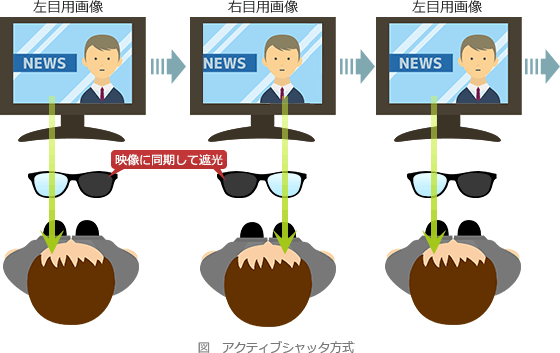

# [令和2年秋期 午前 問11](https://www.ap-siken.com/kakomon/02_aki/q11.html)

#問題 #テクノロジ #コンピュータ構成要素 #入出力装置

解説を表示解説を隠す

<strong>問11</strong>　3D映像の立体視を可能とする仕組みのうち，アクティブシャッタ方式の説明として，適切なものはどれか。

<ul class="ap-choices">
<li class="ap-choice-item ap-wrong">

ア　専用の特殊なディスプレイに右目用，左目用の映像を同時に描画し，網目状のフィルターを用いてそれぞれの映像が右目と左目に入るようにして，裸眼立体視を可能とする。

左右の目の視差を利用するパララックスバリア方式の説明です。裸眼で3D映像の立体視が可能です。

</li>
<li class="ap-choice-item ap-wrong">

イ　ディスプレイに赤色と青色で右目用，左目用の映像を重ねて描画し，一方のリム(フレームにおいてレンズを囲む部分)に赤，他方のリムに青のフィルターを付けた眼鏡で見ることによって，立体視を可能とする。

アナグリフ方式の説明です。赤青のカラーフィルターが付いた眼鏡を使用します。

</li>
<li class="ap-choice-item ap-correct">

ウ　ディスプレイに右目用，左目用の映像を交互に映し出し，眼鏡がそのタイミングに合わせて左右それぞれ交互に透過，遮断することによって，立体視を可能とする。

正しい。アクティブシャッタ方式の説明です。

</li>
<li class="ap-choice-item ap-wrong">

エ　ディスプレイに右目用，左目用の映像を同時に描画し，フィルターを用いてそれぞれの映像の光の振幅方向を回転して，透過する振幅方向が左右で異なる偏光眼鏡で見ることによって，立体視を可能とする。

偏光フィルター方式の説明です。偏光ディスプレイと偏光眼鏡を使用します。

</li>
</ul>

<h4>解説</h4>

アクティブシャッタ方式は、1<a href="用語/フレーム" class="internal-link" data-href="用語/フレーム">フレーム</a>ごとに右目用、左目用の画像を交互に表示し、眼鏡がそのタイミングに<a href="用語/同期" class="internal-link" data-href="用語/同期">同期</a>して一方の目だけを遮光することによって、立体視を可能とする方式です。それぞれを全画面で映し出せるので画像の解像度が落ちない反面、元の<a href="用語/フレームレート" class="internal-link" data-href="用語/フレームレート">フレームレート</a>を維持するには倍速で表示する必要があること、ディスプレイと眼鏡のタイミングを一致させるのが難しいという特徴があります。<a href="用語/フレーム" class="internal-link" data-href="用語/フレーム">フレーム</a>・シーケンシャル方式とも呼ばれます。左右の画像を交互に映し出すというのがアクティブシャッタ方式の特徴です。したがって「ウ」の説明が適切です。

