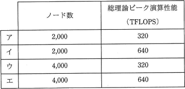

# [令和2年秋期 午前 問12](https://www.ap-siken.com/kakomon/02_aki/q12.html)

#問題 #テクノロジ #システム構成要素 #システムの構成

解説を表示解説を隠す

<strong>問12</strong>　現状のHPC(High Performance Computing)マシンの構成を，次の条件で更新することにした。更新後の，ノード数と総理論ピーク演算性能はどれか。ここで，総理論ピーク演算は，コア数に比例するものとする。  〔現状の構成〕 ・一つのコアの理論ピーク演算性能は10GFLOPSである。 ・一つのノードのコア数は8である。 ・ノード数は1,000である。  〔更新条件〕 ・一つのコアの理論ピーク演算性能を現状の2倍にする。 ・一つのノードのコア数を現状の2倍にする。 ・総コア数を現状の4倍にする。 

<ul class="ap-choices">
<li class="ap-choice-item ap-wrong">

ア

ノード数と総理論ピーク演算<a href="用語/性能" class="internal-link" data-href="用語/性能">性能</a>の組合せが誤っています。組合せは選択肢表を参照してください。

</li>
<li class="ap-choice-item ap-correct">

イ

正しい。更新後のノード数は2,000、総理論ピーク演算<a href="用語/性能" class="internal-link" data-href="用語/性能">性能</a>は640TFLOPSです。

</li>
<li class="ap-choice-item ap-wrong">

ウ

ノード数と総理論ピーク演算<a href="用語/性能" class="internal-link" data-href="用語/性能">性能</a>の組合せが誤っています。組合せは選択肢表を参照してください。

</li>
<li class="ap-choice-item ap-wrong">

エ

ノード数と総理論ピーク演算<a href="用語/性能" class="internal-link" data-href="用語/性能">性能</a>の組合せが誤っています。組合せは選択肢表を参照してください。

</li>
</ul>

<h4>解説</h4>

更新条件(1)～(3)について順番に考えていきます。

<ul>
<li>1つのコアの理論ピーク演算<a href="用語/性能" class="internal-link" data-href="用語/性能">性能</a>は、現状（10GFLOPS）の2倍となるため、10GFLOPS×2＝20GFLOPS</li>
<li>1つのノードのコア数は、現状（8個）の2倍となるため、8個×2＝16個</li>
<li>現状の総コア数は「ノード数1,000×コア数8個＝8,000個」です。更新後の総コア数はその4倍となるため、8,000個×4＝32,000個</li>
</ul>

〔更新後のノード数〕 総コア数32,000個を、1ノードのコア数16で割って「32,000÷16＝2,000」となります。

〔更新後の総理論ピーク演算<a href="用語/性能" class="internal-link" data-href="用語/性能">性能</a>〕 総コア数32,000個に、1コアの理論ピーク演算<a href="用語/性能" class="internal-link" data-href="用語/性能">性能</a>20GFLOPSを乗じた「32,000×20＝640,000GFLOPS」です。単位をGFLOPS⇒TFLOPSにして640TFLOPSとなります。

したがって「イ」の組合せが正解です。

