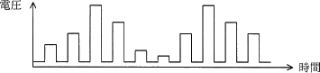
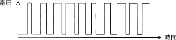
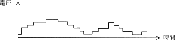
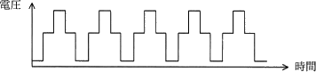
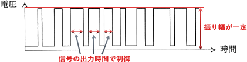

# [令和2年秋期 午前 問22](https://www.ap-siken.com/kakomon/02_aki/q22.html)

#問題 #テクノロジ #ハードウェア #ハードウェア

解説を表示解説を隠す

<strong>問22</strong>　モーターの速度制御などにPWM(Pulse Width Modulation)制御が用いられる。PWMの駆動波形を示したものはどれか。ここで，波形は制御回路のポート出力であり，低域通過フィルターを通していないものとする。

<ul class="ap-choices">
<li class="ap-choice-item ap-wrong">

ア　

振幅が一定ではなく、パルス振幅変調(PAM)に相当する波形です。

</li>
<li class="ap-choice-item ap-correct">

イ　

正しい。振幅が一定でパルス幅が変化する<a href="用語/PWM" class="internal-link" data-href="用語/PWM">PWM</a>の駆動波形です。

</li>
<li class="ap-choice-item ap-wrong">

ウ　

振幅が一定ではないため、<a href="用語/PWM" class="internal-link" data-href="用語/PWM">PWM</a>の駆動波形ではありません。

</li>
<li class="ap-choice-item ap-wrong">

エ　

振幅が一定ではないため、<a href="用語/PWM" class="internal-link" data-href="用語/PWM">PWM</a>の駆動波形ではありません。

</li>
</ul>

<h4>解説</h4>

<a href="用語/PWM" class="internal-link" data-href="用語/PWM">PWM</a>(Pulse Width Modulation，パルス幅変調)は、信号の強度は一定のまま、パルス信号を出力する時間(width)を長くしたり短くしたりすることで電流・電圧を制御する方式で、インバータの制御方式として用いられています。

<a href="用語/PWM" class="internal-link" data-href="用語/PWM">PWM</a>とは別に、パルス信号を出力する時間は一定で、信号の強度(振幅)によって制御する方式をPAM(Pulse Amplitude Modulation，パルス振幅変調)といいます。

選択肢の波形のうち、波形の振幅が一定なのは「イ」のみなので、これが<a href="用語/PWM" class="internal-link" data-href="用語/PWM">PWM</a>の駆動波形として適切です。

