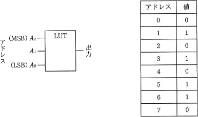
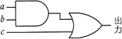
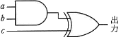
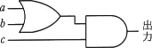
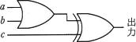
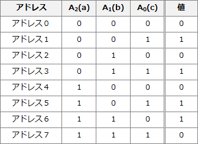
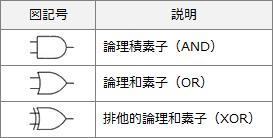
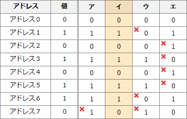

# [令和2年秋期 午前 問23](https://www.ap-siken.com/kakomon/02_aki/q23.html)

#問題 #テクノロジ #ハードウェア

解説を表示解説を隠す

<strong>問23</strong>　次の表に示す値が格納されたLUT(Lookup Table)と等価な回路はどれか。ここで，LUTのアドレス信号A2～A0はA0がLSBで，ア～エの回路の入力信号aがA2，bがA1，cがA0に対応する。 

<ul class="ap-choices">
<li class="ap-choice-item ap-wrong">

ア　

アドレス7の値が1になるので誤りです。

</li>
<li class="ap-choice-item ap-correct">

イ　

正しい。どの入力信号の組合せでもLUTの値と一致します。

</li>
<li class="ap-choice-item ap-wrong">

ウ　

アドレス7の値が1になる等で誤りです。

</li>
<li class="ap-choice-item ap-wrong">

エ　

アドレス2の値が1になる等で誤りです。

</li>
</ul>

<h4>解説</h4>

LUT(Lookup Table)は、複雑な計算処理を繰り返さなくても済むように、入力に対する出力をあらかじめ保持しておく<a href="用語/データ構造" class="internal-link" data-href="用語/データ構造">データ構造</a>です。この設問に置き換えると、3つの入力信号それぞれが"0"または"1"の可能性があるので、入力値としては"000"～"111"までの8種類の組合せがあり、これらをアドレス0～7に保持しておくということになります。

入力信号の組合せとアドレスおよび出力値を紐付けると以下のようになります。

後はこれと同じ出力をする回路図を消去法で見つけるだけです。なお、各回路の意味については下表の通りです。

