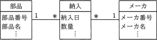
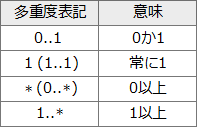
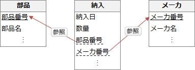

# [令和2年秋期 午前 問27](https://www.ap-siken.com/kakomon/02_aki/q27.html)

#問題 #テクノロジ #データベース #データベース設計

解説を表示解説を隠す

<strong>問27</strong>　UMLを用いて表した図のデータモデルから，"部品"表，"納入"表及び"メーカー"表を関係データベース上に定義するときの解釈のうち，適切なものはどれか。 

<ul class="ap-choices">
<li class="ap-choice-item ap-wrong">

ア　同一の部品を同一のメーカーから複数回納入することは許されない。

"納入"表には、部品番号とメーカ番号が同じで納入日が異なる<a href="用語/レコード" class="internal-link" data-href="用語/レコード">レコード</a>を追加できるので、同一の部品を同一のメーカーから複数回納入することが許されていると解釈できます。

</li>
<li class="ap-choice-item ap-wrong">

イ　"納入"表に外部キーは必要ない。

"納入"表には少なくとも"部品番号"と"メーカ番号"の2つの<a href="用語/外部キー" class="internal-link" data-href="用語/外部キー">外部キー</a>が含まれます。

</li>
<li class="ap-choice-item ap-correct">

ウ　部品番号とメーカ番号の組みを"納入"表の候補キーの一部にできる。

正しい。"納入"表の<a href="用語/主キー" class="internal-link" data-href="用語/主キー">主キー</a>としては、納入番号のように重複のない連番の<a href="用語/属性" class="internal-link" data-href="用語/属性">属性</a>（<a href="用語/サロゲートキー" class="internal-link" data-href="用語/サロゲートキー">サロゲートキー</a>）を用意して<a href="用語/主キー" class="internal-link" data-href="用語/主キー">主キー</a>とするパターンと、納入日・部品番号・メーカ番号の複合<a href="用語/主キー" class="internal-link" data-href="用語/主キー">主キー</a>にするパターンが考えられます。複合<a href="用語/主キー" class="internal-link" data-href="用語/主キー">主キー</a>を採用した場合には、部品番号とメーカ番号を候補キーの一部として使うことになります。候補キーとは、ある表の1つの<a href="用語/レコード" class="internal-link" data-href="用語/レコード">レコード</a>を一意に決定できる<a href="用語/属性" class="internal-link" data-href="用語/属性">属性</a>、または<a href="用語/属性" class="internal-link" data-href="用語/属性">属性</a>の組合せで極小のものです。

</li>
<li class="ap-choice-item ap-wrong">

エ　"メーカー"表は，外部キーとして部品番号をもつことになる。

"部品"<a href="用語/クラス" class="internal-link" data-href="用語/クラス">クラス</a>と"メーカー"<a href="用語/クラス" class="internal-link" data-href="用語/クラス">クラス</a>は、"納入"<a href="用語/クラス" class="internal-link" data-href="用語/クラス">クラス</a>を介した多対多の関係になります。<a href="用語/クラス" class="internal-link" data-href="用語/クラス">クラス</a>間に直接の関連はありませんので、"メーカー"表が<a href="用語/外部キー" class="internal-link" data-href="用語/外部キー">外部キー</a>として部品番号を持つことはありません。

</li>
</ul>

<h4>解説</h4>

<a href="用語/UML" class="internal-link" data-href="用語/UML">UML</a>の<a href="用語/クラス図" class="internal-link" data-href="用語/クラス図">クラス図</a>では<a href="用語/クラス" class="internal-link" data-href="用語/クラス">クラス</a>同士の多重度を以下の表記で表します。

1対多で関連付けられる<a href="用語/クラス" class="internal-link" data-href="用語/クラス">クラス</a>同士を関係データベースとして実装すると、"1"側に<a href="用語/主キー" class="internal-link" data-href="用語/主キー">主キー</a>が含まれ、"多"側に<a href="用語/外部キー" class="internal-link" data-href="用語/外部キー">外部キー</a>が含まれる関係になります。これを踏まえて図の<a href="用語/データモデル" class="internal-link" data-href="用語/データモデル">データモデル</a>を関係データベースとして定義すると次のようになります。

