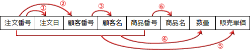
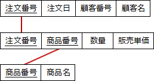
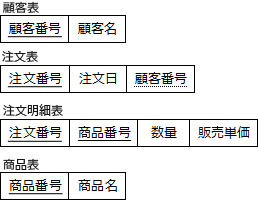

# [令和2年秋期 午前 問28](https://www.ap-siken.com/kakomon/02_aki/q28.html)

#問題 #テクノロジ #データベース #データベース設計

解説を表示解説を隠す

<strong>問28</strong>　関係"注文記録"の属性間に①～⑥の関数従属性があり，それに基づいて第3正規形まで正規化を行って，"商品"，"顧客"，"注文"，"注文明細"の各関係に分解した。関係"注文明細"として，適切なものはどれか。ここで，{X，Y} は，属性XとYの組みを表し，X→Yは，XがYを関数的に決定することを表す。また，実線の下線は主キーを表す。  注文記録（注文番号，注文日，顧客番号，顧客名，商品番号，商品名，数量，販売単価）  〔関係従属性〕 ① 注文番号 → 注文日 ② 注文番号 → 顧客番号 ③ 顧客番号 → 顧客名 ④ {注文番号，商品番号} → 数量 ⑤ {注文番号，商品番号} → 販売単価 ⑥ 商品番号 → 商品名

<ul class="ap-choices">
<li class="ap-choice-item ap-wrong">

ア　注文明細(<u>注文番号</u>，<u>顧客番号</u>，<u>商品番号</u>，顧客名，数量，販売単価)

顧客名は第3正規化の段階で"顧客"表に分離される。注文明細の<a href="用語/主キー" class="internal-link" data-href="用語/主キー">主キー</a>は{注文番号，商品番号}の組合せである。

</li>
<li class="ap-choice-item ap-wrong">

イ　注文明細(<u>注文番号</u>，<u>顧客番号</u>，数量，販売単価)

商品番号がなく、<a href="用語/主キー" class="internal-link" data-href="用語/主キー">主キー</a>の構成が誤り。数量・販売単価は{注文番号，商品番号}によって決まる。

</li>
<li class="ap-choice-item ap-correct">

ウ　注文明細(<u>注文番号</u>，<u>商品番号</u>，数量，販売単価)

正しい。注文明細の<a href="用語/主キー" class="internal-link" data-href="用語/主キー">主キー</a>は{注文番号，商品番号}、<a href="用語/属性" class="internal-link" data-href="用語/属性">属性</a>は数量と販売単価である。

</li>
<li class="ap-choice-item ap-wrong">

エ　注文明細(<u>注文番号</u>，数量，販売単価)

商品番号が欠けており、<a href="用語/主キー" class="internal-link" data-href="用語/主キー">主キー</a>が不完全。同一注文で複数商品を区別できない。

</li>
</ul>

<h4>解説</h4>

設問で示されている<a href="用語/属性" class="internal-link" data-href="用語/属性">属性</a>同士の従属<a href="用語/関係" class="internal-link" data-href="用語/関係">関係</a>を整理すると次のようになります。

この<a href="用語/関係" class="internal-link" data-href="用語/関係">関係</a>を見ると"注文番号"と"商品番号"の両方が決まることで全ての<a href="用語/属性" class="internal-link" data-href="用語/属性">属性</a>が一意に定まるため、<a href="用語/主キー" class="internal-link" data-href="用語/主キー">主キー</a>はこの2つを組み合わせた複合キーとわかります。また、この時点で全ての項目が単一値（繰り返し項目がない）ですので第1<a href="用語/正規化" class="internal-link" data-href="用語/正規化">正規化</a>までは完了しています。続けて第2、第3<a href="用語/正規化" class="internal-link" data-href="用語/正規化">正規化</a>を行います。

第2<a href="用語/正規化" class="internal-link" data-href="用語/正規化">正規化</a>では、複合<a href="用語/主キー" class="internal-link" data-href="用語/主キー">主キー</a>の部分キーによって一意に定まる<a href="用語/属性" class="internal-link" data-href="用語/属性">属性</a>を別表に移します。設問のリレーションでは以下の4つがこれに該当します。

① 注文番号→注文日 ② 注文番号→顧客番号 ③ 顧客番号→顧客名（推移律※により、注文番号→顧客名） ⑥ 商品番号→商品名

この3つの<a href="用語/関係" class="internal-link" data-href="用語/関係">関係</a>を別表に分離すると以下の3つの表ができます。

最後に第3<a href="用語/正規化" class="internal-link" data-href="用語/正規化">正規化</a>を行います。第3<a href="用語/正規化" class="internal-link" data-href="用語/正規化">正規化</a>では、<a href="用語/主キー" class="internal-link" data-href="用語/主キー">主キー</a>以外の<a href="用語/属性" class="internal-link" data-href="用語/属性">属性</a>によって一意に定まる<a href="用語/属性" class="internal-link" data-href="用語/属性">属性</a>を別表に移します。第2<a href="用語/正規化" class="internal-link" data-href="用語/正規化">正規化</a>後の<a href="用語/関係" class="internal-link" data-href="用語/関係">関係</a>では1つがこれに該当します。

③ 顧客番号→顧客名

この<a href="用語/関係" class="internal-link" data-href="用語/関係">関係</a>を別表に移すと"商品"、"顧客"、"注文"、"注文明細"の4つの表に<a href="用語/正規化" class="internal-link" data-href="用語/正規化">正規化</a>されます。

したがって"注文明細"表がもつ<a href="用語/属性" class="internal-link" data-href="用語/属性">属性</a>の組合せは「ウ」になります。

※推移律：X→Y かつ Y→Z が成立するならば、X→Z が成立する

