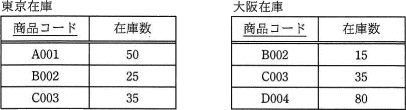
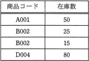
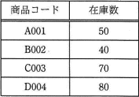
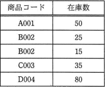
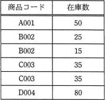
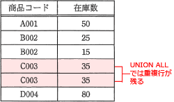

# [令和2年秋期 午前 問29](https://www.ap-siken.com/kakomon/02_aki/q29.html)

#問題 #テクノロジ #データベース #データ操作

解説を表示解説を隠す

<strong>問29</strong>　"東京在庫"表と"大阪在庫"表に対して，SQL文を実行して得られる結果はどれか。ここで，実線の下線は主キーを表す。 〔SQL文〕 SELECT 商品コード，在庫数 FROM 東京在庫 UNION ALL SELECT 商品コード，在庫数 FROM 大阪在庫 

<ul class="ap-choices">
<li class="ap-choice-item ap-wrong">

ア　

本問のUNION ALLの結果とは一致しません。結果表は選択肢図を参照してください。

</li>
<li class="ap-choice-item ap-wrong">

イ　

本問のUNION ALLの結果とは一致しません。結果表は選択肢図を参照してください。

</li>
<li class="ap-choice-item ap-wrong">

ウ　

UNION（ALLなし）で重複行が削除された結果です。本問はUNION ALLです。

</li>
<li class="ap-choice-item ap-correct">

エ　

正しい。UNION ALLは重複行を残すため、両表をそのまま統合した結果です。

</li>
</ul>

<h4>解説</h4>

UNION句は、<a href="用語/和集合" class="internal-link" data-href="用語/和集合">和集合</a>演算を行う演算子で、複数の<a href="用語/SELECT文" class="internal-link" data-href="用語/SELECT文">SELECT文</a>の結果セットを1つに統合する機能を持ちます。通常のUNIONでは、2つの結果セットに全く同じ<a href="用語/レコード" class="internal-link" data-href="用語/レコード">レコード</a>があった場合に重複行が削除された結果を返しますが、UNION ALLでは重複行を含めた結果を返します。

"東京在庫"表と"大阪在庫"表には共通する<a href="用語/レコード" class="internal-link" data-href="用語/レコード">レコード</a>{商品コード:C003,在庫数:35}がありますが、UNION ALLで結合するので重複行がそのまま残されることになります。

したがって、"東京在庫"表と"大阪在庫"表をそのまま統合した「エ」が適切です。ちなみにUNIONで結合した場合は「ウ」の結果が得られます。

