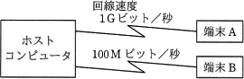

# [令和2年秋期 午前 問32](https://www.ap-siken.com/kakomon/02_aki/q32.html)

#問題 #テクノロジ #ネットワーク #ネットワーク方式

解説を表示解説を隠す

<strong>問32</strong>　図のようなネットワーク構成のシステムにおいて，同じメッセージ長のデータをホストコンピュータとの間で送受信した場合のターンアラウンドタイムは，端末Aでは100ミリ秒，端末Bでは820ミリ秒であった。上り，下りのメッセージ長は同じ長さで，ホストコンピュータでの処理時間は端末A，端末Bのどちらから利用しても同じとするとき，端末Aからホストコンピュータへの片道の伝送時間は何ミリ秒か。ここで，ターンアラウンドタイムは，端末がデータを回線に送信し始めてから応答データを受信し終わるまでの時間とし，伝送時間は回線速度だけに依存するものとする。 

<ul class="ap-choices">
<li class="ap-choice-item ap-wrong">

ア　10

端末Aの片道の伝送時間ではない。

</li>
<li class="ap-choice-item ap-wrong">

イ　20

ホストコンピュータでの処理時間であり，端末Aからホストコンピュータへの片道の伝送時間ではない。

</li>
<li class="ap-choice-item ap-wrong">

ウ　30

端末Aの片道の伝送時間ではない。

</li>
<li class="ap-choice-item ap-correct">

エ　40

正しい。端末Aの<a href="用語/ターンアラウンドタイム" class="internal-link" data-href="用語/ターンアラウンドタイム">ターンアラウンドタイム</a>からホストコンピュータでの処理時間を差し引き，上下の伝送時間が等しいので半分にすれば片道の伝送時間になる。

</li>
</ul>

<h4>解説</h4>

2つの回線の速度差に着目して答えを導いていきます。

まずホストコンピュータでの処理時間を求めます。伝送時間は<a href="用語/ターンアラウンドタイム" class="internal-link" data-href="用語/ターンアラウンドタイム">ターンアラウンドタイム</a>からホストコンピュータの処理時間を差し引いた時間なので、ホストコンピュータの処理時間を a とすると、次のような式で表せます。

端末A：(100－a)ミリ秒 端末B：(820－a)ミリ秒

この値と2つの回線速度の速度差が「10倍」であることを利用すると

(100－a)×10＝820－a

という方程式を立てることができます。この式を解きホストコンピュータでの処理時間を導きます。

(100－a)×10＝820－a 1000－10a＝820－a 180＝9a a＝20ミリ秒

上り、下りのメッセージ長は同じ長さですから、端末Aの<a href="用語/ターンアラウンドタイム" class="internal-link" data-href="用語/ターンアラウンドタイム">ターンアラウンドタイム</a>からホストコンピュータでの処理時間を差し引いて、それを半分にすれば片道の伝送時間がわかります。

(100－20)÷2＝40ミリ秒

したがって「エ」が正解です。

