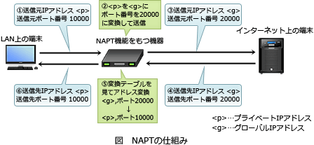

# [令和2年秋期 午前 問34](https://www.ap-siken.com/kakomon/02_aki/q34.html)

#問題 #テクノロジ #ネットワーク #ネットワーク方式

解説を表示解説を隠す

<strong>問34</strong>　TCP，UDPのポート番号を識別し，プライベートIPアドレスとグローバルIPアドレスとの対応関係を管理することによって，プライベートIPアドレスを使用するLAN上の複数の端末が，一つのグローバルIPアドレスを共有してインターネットにアクセスする仕組みはどれか。

<ul class="ap-choices">
<li class="ap-choice-item ap-wrong">

ア　IPスプーフィング

これは<a href="用語/IPスプーフィング" class="internal-link" data-href="用語/IPスプーフィング">IPスプーフィング</a>の説明です。IPアドレスを偽装し正規のユーザーに<a href="用語/なりすまし" class="internal-link" data-href="用語/なりすまし">なりすまし</a>てアクセスを行う攻撃手法です。

</li>
<li class="ap-choice-item ap-wrong">

イ　IPマルチキャスト

これは<a href="用語/マルチキャスト" class="internal-link" data-href="用語/マルチキャスト">マルチキャスト</a>の説明です。IPパケットを1回で複数の受信者に送信する方法です。1回で1人の受信者に送信することを<a href="用語/ユニキャスト" class="internal-link" data-href="用語/ユニキャスト">ユニキャスト</a>、同じネットワークセグメントのすべての受信者に送信することを<a href="用語/ブロードキャスト" class="internal-link" data-href="用語/ブロードキャスト">ブロードキャスト</a>といいます。

</li>
<li class="ap-choice-item ap-correct">

ウ　NAPT

正しい。1つの<a href="用語/グローバルIPアドレス" class="internal-link" data-href="用語/グローバルIPアドレス">グローバルIPアドレス</a>でプライベートネットワーク内の複数の端末をインターネットに同時に接続できる技術です。

</li>
<li class="ap-choice-item ap-wrong">

エ　NTP

これは<a href="用語/NTP" class="internal-link" data-href="用語/NTP">NTP</a>の説明です。ネットワークに接続されている環境で、機器の時計を協定世界時(UTC)へ同期するための通信プロトコルです。

</li>
</ul>

<h4>解説</h4>

<a href="用語/NAPT" class="internal-link" data-href="用語/NAPT">NAPT</a>(Network Address Port Translation)は、<a href="用語/プライベートIPアドレス" class="internal-link" data-href="用語/プライベートIPアドレス">プライベートIPアドレス</a>と<a href="用語/グローバルIPアドレス" class="internal-link" data-href="用語/グローバルIPアドレス">グローバルIPアドレス</a>を1対1で相互変換する<a href="用語/NAT" class="internal-link" data-href="用語/NAT">NAT</a>の考え方に、<a href="用語/ポート番号" class="internal-link" data-href="用語/ポート番号">ポート番号</a>でのクライアント識別を組み合わせた技術です。IPマスカレードとも呼ばれます。

<a href="用語/TCP/IP" class="internal-link" data-href="用語/TCP/IP">TCP/IP</a>の原則に従えば、複数の端末がインターネットに接続する場合には、それに対応する数の<a href="用語/グローバルIPアドレス" class="internal-link" data-href="用語/グローバルIPアドレス">グローバルIPアドレス</a>が必要です。しかし、<a href="用語/NAPT" class="internal-link" data-href="用語/NAPT">NAPT</a>を利用すると内部<a href="用語/LAN" class="internal-link" data-href="用語/LAN">LAN</a>上の複数の端末を、1つの<a href="用語/グローバルIPアドレス" class="internal-link" data-href="用語/グローバルIPアドレス">グローバルIPアドレス</a>で同時にインターネットに接続させることが可能です。<a href="用語/NAPT" class="internal-link" data-href="用語/NAPT">NAPT</a>では、<a href="用語/プライベートIPアドレス" class="internal-link" data-href="用語/プライベートIPアドレス">プライベートIPアドレス</a>とインターネット通信に使用する<a href="用語/ポート番号" class="internal-link" data-href="用語/ポート番号">ポート番号</a>を対応させることで端末の識別を行っています。

