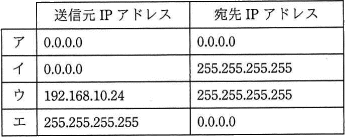
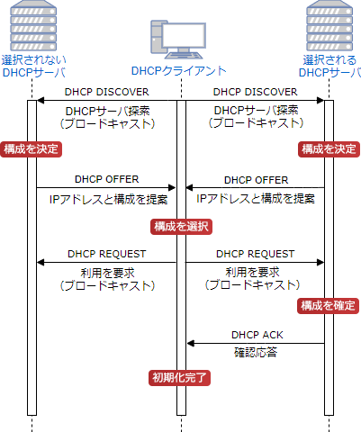
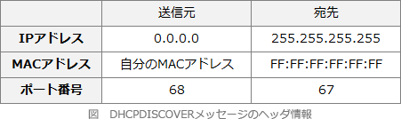

# [令和2年秋期 午前 問35](https://www.ap-siken.com/kakomon/02_aki/q35.html)

#問題 #テクノロジ #ネットワーク #通信プロトコル

解説を表示解説を隠す

<strong>問35</strong>　IPv4ネットワークにおいて，IPアドレスを付与されていないPCがDHCPサーバを利用してネットワーク設定を行う際，最初にDHCPDISCOVERメッセージをブロードキャストする。このメッセージの送信元IPアドレスと宛先IPアドレスの適切な組合せはどれか。ここで，このPCにはDHCPサーバからIPアドレス192.168.10.24が付与されるものとする。 

<ul class="ap-choices">
<li class="ap-choice-item ap-wrong">

ア

送信元は0.0.0.0でよいが、宛先が0.0.0.0では<a href="用語/DHCP" class="internal-link" data-href="用語/DHCP">DHCP</a><a href="用語/サーバ" class="internal-link" data-href="用語/サーバ">サーバ</a>探索のための<a href="用語/ブロードキャスト" class="internal-link" data-href="用語/ブロードキャスト">ブロードキャスト</a>にならない。

</li>
<li class="ap-choice-item ap-correct">

イ

正しい。送信元<a href="用語/IPアドレス" class="internal-link" data-href="用語/IPアドレス">IPアドレス</a>は未割当てのため0.0.0.0、宛先<a href="用語/IPアドレス" class="internal-link" data-href="用語/IPアドレス">IPアドレス</a>は同一セグメント内の<a href="用語/DHCP" class="internal-link" data-href="用語/DHCP">DHCP</a><a href="用語/サーバ" class="internal-link" data-href="用語/サーバ">サーバ</a>探索のため255.255.255.255（<a href="用語/ブロードキャスト" class="internal-link" data-href="用語/ブロードキャスト">ブロードキャスト</a>）となる。

</li>
<li class="ap-choice-item ap-wrong">

ウ

DHCPDISCOVER送信時点では<a href="用語/IPアドレス" class="internal-link" data-href="用語/IPアドレス">IPアドレス</a>は未割当てのため、送信元に割当予定の192.168.10.24を用いる組合せは適切ではない。

</li>
<li class="ap-choice-item ap-wrong">

エ

送信元<a href="用語/IPアドレス" class="internal-link" data-href="用語/IPアドレス">IPアドレス</a>は未割当てのため0.0.0.0とする。送信元に255.255.255.255、宛先に0.0.0.0を用いる組合せは適切ではない。

</li>
</ul>

<h4>解説</h4>

<a href="用語/DHCP" class="internal-link" data-href="用語/DHCP">DHCP</a><a href="用語/クライアント" class="internal-link" data-href="用語/クライアント">クライアント</a>と<a href="用語/DHCP" class="internal-link" data-href="用語/DHCP">DHCP</a><a href="用語/サーバ" class="internal-link" data-href="用語/サーバ">サーバ</a>は、DHCPDISCOVER、DHCPOFFER、DHCPREQUEST、DHCPACKの4つのメッセージのやり取りによって、ネットワークアドレス等の割当てを行います。ざっくりと流れを確認しておきましょう。

<ul>
<li><a href="用語/IPアドレス" class="internal-link" data-href="用語/IPアドレス">IPアドレス</a>割り当てを要求する<a href="用語/DHCP" class="internal-link" data-href="用語/DHCP">DHCP</a><a href="用語/クライアント" class="internal-link" data-href="用語/クライアント">クライアント</a>(以下、<a href="用語/クライアント" class="internal-link" data-href="用語/クライアント">クライアント</a>)は、ネットワーク内の<a href="用語/DHCP" class="internal-link" data-href="用語/DHCP">DHCP</a><a href="用語/サーバ" class="internal-link" data-href="用語/サーバ">サーバ</a>(以下、<a href="用語/サーバ" class="internal-link" data-href="用語/サーバ">サーバ</a>)を見つけるため<a href="用語/DHCP" class="internal-link" data-href="用語/DHCP">DHCP</a>発見<a href="用語/パケット" class="internal-link" data-href="用語/パケット">パケット</a>を<a href="用語/ブロードキャスト" class="internal-link" data-href="用語/ブロードキャスト">ブロードキャスト</a>で送信する（DHCPDISCOVER）。</li>
<li><a href="用語/DHCP" class="internal-link" data-href="用語/DHCP">DHCP</a>発見<a href="用語/パケット" class="internal-link" data-href="用語/パケット">パケット</a>を受け取った<a href="用語/サーバ" class="internal-link" data-href="用語/サーバ">サーバ</a>は、使用可能な<a href="用語/IPアドレス" class="internal-link" data-href="用語/IPアドレス">IPアドレス</a>と<a href="用語/サブネットマスク" class="internal-link" data-href="用語/サブネットマスク">サブネットマスク</a>などのネットワーク設定を<a href="用語/クライアント" class="internal-link" data-href="用語/クライアント">クライアント</a>に通知する（DHCPOFFER）。</li>
<li><a href="用語/クライアント" class="internal-link" data-href="用語/クライアント">クライアント</a>は通知されたネットワーク設定を使用することを<a href="用語/サーバ" class="internal-link" data-href="用語/サーバ">サーバ</a>に<a href="用語/ブロードキャスト" class="internal-link" data-href="用語/ブロードキャスト">ブロードキャスト</a>で通知する（DHCPREQUEST）。</li>
<li><a href="用語/サーバ" class="internal-link" data-href="用語/サーバ">サーバ</a>は、配布する<a href="用語/IPアドレス" class="internal-link" data-href="用語/IPアドレス">IPアドレス</a>が未使用であることを確認し、<a href="用語/クライアント" class="internal-link" data-href="用語/クライアント">クライアント</a>に確認応答<a href="用語/パケット" class="internal-link" data-href="用語/パケット">パケット</a>を送信する（<a href="用語/DHCP" class="internal-link" data-href="用語/DHCP">DHCP</a> ACK)、この際<a href="用語/IPアドレス" class="internal-link" data-href="用語/IPアドレス">IPアドレス</a>が割当て不能だった場合はその旨を<a href="用語/クライアント" class="internal-link" data-href="用語/クライアント">クライアント</a>の通知する（DHCPNACK）。</li>
</ul>

<a href="用語/DHCP" class="internal-link" data-href="用語/DHCP">DHCP</a><a href="用語/クライアント" class="internal-link" data-href="用語/クライアント">クライアント</a>は、DHCPDISCOVERメッセージの送信時点では自身の属するネットワークが明らかになっていなので、宛先<a href="用語/IPアドレス" class="internal-link" data-href="用語/IPアドレス">IPアドレス</a>を「255.255.255.255」にして<a href="用語/ブロードキャスト" class="internal-link" data-href="用語/ブロードキャスト">ブロードキャスト</a>します。これは同一セグメントに属する全てのコンピュータに対して同じメッセージを送信することを意味します。また送信元<a href="用語/IPアドレス" class="internal-link" data-href="用語/IPアドレス">IPアドレス</a>は未割当てなので「0.0.0.0」に設定します。

したがって「イ」の組合せが適切です。

