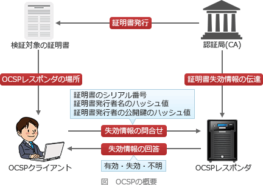

# [令和2年秋期 午前 問38](https://www.ap-siken.com/kakomon/02_aki/q38.html)

#問題 #テクノロジ #セキュリティ #情報セキュリティ

解説を表示解説を隠す

<strong>問38</strong>　OCSPクライアントとOCSPレスポンダとの通信に関する記述のうち，適切なものはどれか。

<ul class="ap-choices">
<li class="ap-choice-item ap-wrong">

ア　デジタル証明書全体をOCSPレスポンダに送信し，その応答でデジタル証明書の有効性を確認する。

<a href="用語/OCSP" class="internal-link" data-href="用語/OCSP">OCSP</a>では<a href="用語/デジタル証明書" class="internal-link" data-href="用語/デジタル証明書">デジタル証明書</a>全体ではなく、シリアル番号等を送信して有効性を確認します。

</li>
<li class="ap-choice-item ap-wrong">

イ　デジタル証明書全体をOCSPレスポンダに送信し，その応答としてタイムスタンプトークンの発行を受ける。

<a href="用語/OCSP" class="internal-link" data-href="用語/OCSP">OCSP</a>は<a href="用語/デジタル証明書" class="internal-link" data-href="用語/デジタル証明書">デジタル証明書</a>全体の送信や<a href="用語/タイムスタンプ" class="internal-link" data-href="用語/タイムスタンプ">タイムスタンプ</a>トークンの発行を行うプロトコルではありません。

</li>
<li class="ap-choice-item ap-correct">

ウ　デジタル証明書のシリアル番号，証明書発行者の識別名(DN)のハッシュ値などをOCSPレスポンダに送信し，その応答でデジタル証明書の有効性を確認する。

正しい。シリアル番号等を送信し、有効性検証の結果を受け取ります。

</li>
<li class="ap-choice-item ap-wrong">

エ　デジタル証明書のシリアル番号，証明書発行者の識別名(DN)のハッシュ値などをOCSPレスポンダに送信し，その応答としてタイムスタンプトークンの発行を受ける。

送信内容は<a href="用語/OCSP" class="internal-link" data-href="用語/OCSP">OCSP</a>に近いですが、応答は有効性検証の結果であり、<a href="用語/タイムスタンプ" class="internal-link" data-href="用語/タイムスタンプ">タイムスタンプ</a>トークンの発行ではありません。

</li>
</ul>

<h4>解説</h4>

<a href="用語/OCSP" class="internal-link" data-href="用語/OCSP">OCSP</a>(Online Certificate Status Protocol)は、リアルタイムで<a href="用語/デジタル証明書" class="internal-link" data-href="用語/デジタル証明書">デジタル証明書</a>の失効情報を検証し、有効性を確認するプロトコルです。<a href="用語/OCSP" class="internal-link" data-href="用語/OCSP">OCSP</a>クライアントは、確認対象となる<a href="用語/デジタル証明書" class="internal-link" data-href="用語/デジタル証明書">デジタル証明書</a>のシリアル番号等を<a href="用語/OCSP" class="internal-link" data-href="用語/OCSP">OCSP</a>レスポンダに送信し、有効性検証の結果を受け取ります。この仕組みを利用することで、クライアント自身が<a href="用語/CRL" class="internal-link" data-href="用語/CRL">CRL</a>(証明書失効リスト)を取得・検証する手間を省くことができます。

したがって適切な説明は「ウ」です。

