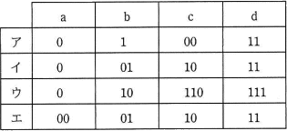

# [令和2年秋期 午前 問4](https://www.ap-siken.com/kakomon/02_aki/q4.html)

#問題 #テクノロジ #基礎理論 #情報に関する理論

解説を表示解説を隠す

<strong>問4</strong>　a，b，c，d の4文字から成るメッセージを符号化してビット列にする方法として表のア～エの4通りを考えた。この表は a，b，c，d の各1文字を符号化するときのビット列を表している。メッセージ中の a，b，c，d の出現頻度は，それぞれ，50%，30%，10%，10% であることが分かっている。符号化されたビット列から元のメッセージが一意に復号可能であって，ビット列の長さが最も短くなるものはどれか。 

<ul class="ap-choices">
<li class="ap-choice-item ap-wrong">

ア

符号化後の<a href="用語/ビット" class="internal-link" data-href="用語/ビット">ビット</a>列に"11"があった場合、bb(11)とd(11)の区別がつかないので、元のメッセージに一意に復号することができません。

</li>
<li class="ap-choice-item ap-wrong">

イ

符号化後の<a href="用語/ビット" class="internal-link" data-href="用語/ビット">ビット</a>列に"00110"があった場合、abc(00110)とaada(00110)の区別がつかないので、元のメッセージに一意に復号することができません。

</li>
<li class="ap-choice-item ap-correct">

ウ

正しい。一意の復号が可能です。各文字の出現頻度を考慮すると、1文字を表現するのに必要な平均<a href="用語/ビット" class="internal-link" data-href="用語/ビット">ビット</a>は、(1×0.5)＋(2×0.3)＋(3×0.1)＋(3×0.1)＝0.5＋0.6＋0.3＋0.3＝1.7となり、4つの中では復号可能かつ<a href="用語/ビット" class="internal-link" data-href="用語/ビット">ビット</a>列の長さが最も短くなる方法となります。

</li>
<li class="ap-choice-item ap-wrong">

エ

各文字が2<a href="用語/ビット" class="internal-link" data-href="用語/ビット">ビット</a>ずつなので一意の復号が可能です。1文字を表現するのに必要な平均<a href="用語/ビット" class="internal-link" data-href="用語/ビット">ビット</a>は2<a href="用語/ビット" class="internal-link" data-href="用語/ビット">ビット</a>なので、「ウ」の方式よりは<a href="用語/ビット" class="internal-link" data-href="用語/ビット">ビット</a>列が長くなります。

</li>
</ul>

<h4>解説</h4>

最小<a href="用語/ビット" class="internal-link" data-href="用語/ビット">ビット</a>で圧縮できる方式を考える前に、各方式が符号化された<a href="用語/ビット" class="internal-link" data-href="用語/ビット">ビット</a>列から元のメッセージを一意に復号可能かどうかを検証し、条件を満たす方式についてだけ<a href="用語/ビット" class="internal-link" data-href="用語/ビット">ビット</a>数を計算します。

「ウ」のように、出現頻度の高い文字に短い<a href="用語/ビット" class="internal-link" data-href="用語/ビット">ビット</a>列を、出現頻度が低い文字に長い<a href="用語/ビット" class="internal-link" data-href="用語/ビット">ビット</a>列を割り当てて表現することで、1文字を表現するのに使用する平均<a href="用語/ビット" class="internal-link" data-href="用語/ビット">ビット</a>長を最小とする圧縮技術を「<a href="用語/ハフマン符号" class="internal-link" data-href="用語/ハフマン符号">ハフマン符号</a>化」と言います。

