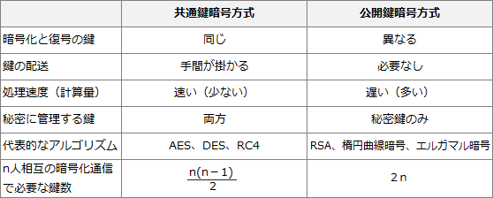

# [令和2年秋期 午前 問42](https://www.ap-siken.com/kakomon/02_aki/q42.html)

#問題 #テクノロジ #セキュリティ #情報セキュリティ

解説を表示解説を隠す

<strong>問42</strong>　暗号方式に関する記述のうち，適切なものはどれか。

<ul class="ap-choices">
<li class="ap-choice-item ap-wrong">

ア　AESは公開鍵暗号方式，RSAは共通鍵暗号方式の一種である。

記述は逆に説明しています。<a href="用語/AES" class="internal-link" data-href="用語/AES">AES</a>は<a href="用語/共通鍵暗号方式" class="internal-link" data-href="用語/共通鍵暗号方式">共通鍵暗号方式</a>、RSAは<a href="用語/公開鍵暗号方式" class="internal-link" data-href="用語/公開鍵暗号方式">公開鍵暗号方式</a>です。

</li>
<li class="ap-choice-item ap-correct">

イ　共通鍵暗号方式では，暗号化及び復号に同一の鍵を使用する。

正しい。<a href="用語/共通鍵暗号方式" class="internal-link" data-href="用語/共通鍵暗号方式">共通鍵暗号方式</a>は、"共通鍵"という名前のとおり暗号化と復号に同じ鍵を使用します。錠をかけるのと開けるのとで同じ鍵を使用する、玄関のドアのようなイメージです。

</li>
<li class="ap-choice-item ap-wrong">

ウ　公開鍵暗号方式を通信内容の秘匿に使用する場合は，暗号化に使用する鍵を秘密にして，復号に使用する鍵を公開する。

<a href="用語/公開鍵暗号方式" class="internal-link" data-href="用語/公開鍵暗号方式">公開鍵暗号方式</a>では、暗号化に使用する鍵を公開し、復号に使用する鍵は所有者が秘密として管理します。暗号化は誰でもできますが、復号できるのは正当な受信者だけという仕組みにより、通信の<a href="用語/機密性" class="internal-link" data-href="用語/機密性">機密性</a>が確保されます。

</li>
<li class="ap-choice-item ap-wrong">

エ　デジタル署名に公開鍵暗号方式が使用されることはなく，共通鍵暗号方式が使用される。

<a href="用語/共通鍵暗号方式" class="internal-link" data-href="用語/共通鍵暗号方式">共通鍵暗号方式</a>ではありません。<a href="用語/デジタル署名" class="internal-link" data-href="用語/デジタル署名">デジタル署名</a>は、<a href="用語/公開鍵暗号方式" class="internal-link" data-href="用語/公開鍵暗号方式">公開鍵暗号方式</a>を利用して実現されています。具体的には、送信者が自分の<a href="用語/秘密鍵" class="internal-link" data-href="用語/秘密鍵">秘密鍵</a>で署名データを作成し、受信者は送信者の<a href="用語/公開鍵" class="internal-link" data-href="用語/公開鍵">公開鍵</a>で署名データの検証を行います。

</li>
</ul>

<h4>解説</h4>

暗号方式の基本的な性質（共通鍵・<a href="用語/公開鍵" class="internal-link" data-href="用語/公開鍵">公開鍵</a>の鍵の使い方、代表方式、<a href="用語/デジタル署名" class="internal-link" data-href="用語/デジタル署名">デジタル署名</a>との関係）を問う問題です。各選択肢の記述が実際の方式と一致するかを確認します。

