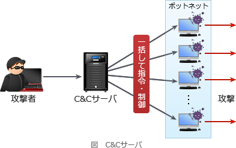

# [令和2年秋期 午前 問43](https://www.ap-siken.com/kakomon/02_aki/q43.html)

#問題 #テクノロジ #セキュリティ #情報セキュリティ

解説を表示解説を隠す

<strong>問43</strong>　ボットネットにおけるC&amp;Cサーバの役割として，適切なものはどれか。

<ul class="ap-choices">
<li class="ap-choice-item ap-wrong">

ア　Webサイトのコンテンツをキャッシュし，本来のサーバに代わってコンテンツを利用者に配信することによって，ネットワークやサーバの負荷を軽減する。

これは<a href="用語/CDN" class="internal-link" data-href="用語/CDN">CDN</a>の説明です。

</li>
<li class="ap-choice-item ap-wrong">

イ　外部からインターネットを経由して社内ネットワークにアクセスする際に，CHAPなどのプロトコルを中継することによって，利用者認証時のパスワードの盗聴を防止する。

これは<a href="用語/認証サーバ" class="internal-link" data-href="用語/認証サーバ">認証サーバ</a>の役割です。

</li>
<li class="ap-choice-item ap-wrong">

ウ　外部からインターネットを経由して社内ネットワークにアクセスする際に，時刻同期方式を採用したワンタイムパスワードを発行することによって，利用者認証時のパスワードの盗聴を防止する。

これは<a href="用語/認証サーバ" class="internal-link" data-href="用語/認証サーバ">認証サーバ</a>の役割です。

</li>
<li class="ap-choice-item ap-correct">

エ　侵入して乗っ取ったコンピュータに対して，他のコンピュータへの攻撃などの不正な操作をするよう，外部から命令を出したり応答を受け取ったりする。

正しい。C&amp;Cサーバの役割です。

</li>
</ul>

<h4>解説</h4>

C&amp;Cサーバ(コマンド・コントロール・サーバ)は、マルウェアが侵入に成功したコンピュータ群(<a href="用語/ボットネット" class="internal-link" data-href="用語/ボットネット">ボットネット</a>)の動作を制御するために用いられる外部の指令サーバです。マルウェアはC&amp;Cサーバからの指令を受けて、乗っ取ったコンピュータで悪意のある活動を行います。単純に外部から内部ネットワークに存在するマルウェアに対して通信を試みてもFWなどで遮断されてしまうため、マルウェア側からC&amp;Cサーバに対して定期的に問い合わせを行い、その応答を使って指令を行う仕組みが用いられています。この仕組みを「コネクトバック通信」といいます。

したがって「エ」が適切な記述です。

