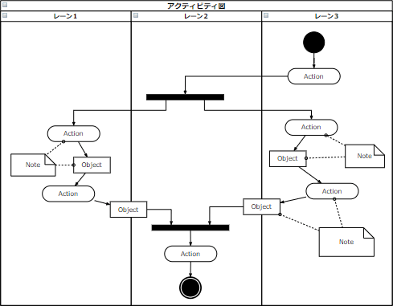

# [令和2年秋期 午前 問46](https://www.ap-siken.com/kakomon/02_aki/q46.html)

#問題 #テクノロジ #システム開発技術 #システム要件定義・ソフトウェア要件定義

解説を表示解説を隠す

<strong>問46</strong>　UMLのアクティビティ図の特徴はどれか。

<ul class="ap-choices">
<li class="ap-choice-item ap-correct">

ア　多くの並行処理を含むシステムの，オブジェクトの振る舞いが記述できる。

正しい。<a href="用語/アクティビティ図" class="internal-link" data-href="用語/アクティビティ図">アクティビティ図</a>の特徴です。

</li>
<li class="ap-choice-item ap-wrong">

イ　オブジェクト群がどのようにコラボレーションを行うか記述できる。

<a href="用語/コミュニケーション図" class="internal-link" data-href="用語/コミュニケーション図">コミュニケーション図</a>の特徴です。

</li>
<li class="ap-choice-item ap-wrong">

ウ　クラスの仕様と，クラスの間の静的な関係が記述できる。

<a href="用語/クラス図" class="internal-link" data-href="用語/クラス図">クラス図</a>の特徴です。

</li>
<li class="ap-choice-item ap-wrong">

エ　システムのコンポーネント間の物理的な関係が記述できる。

<a href="用語/コンポーネント図" class="internal-link" data-href="用語/コンポーネント図">コンポーネント図</a>の特徴です。

</li>
</ul>

<h4>解説</h4>

<a href="用語/アクティビティ図" class="internal-link" data-href="用語/アクティビティ図">アクティビティ図</a>は、ビジネスプロセスの流れやプログラムの制御フローのような一連の手続きを可視化できる図です。<a href="用語/フローチャート" class="internal-link" data-href="用語/フローチャート">フローチャート</a>の<a href="用語/UML" class="internal-link" data-href="用語/UML">UML</a>版と言えるでしょう。<a href="用語/フローチャート" class="internal-link" data-href="用語/フローチャート">フローチャート</a>と似た表記法で処理の流れを記述できるほか、処理の分岐やマージ、並行処理のフォークやジョイン、タイマー制御や例外処理なども表現できるようになっています。

したがって「ア」が適切な記述です。

