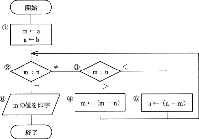

# [令和2年秋期 午前 問47](https://www.ap-siken.com/kakomon/02_aki/q47.html)

#問題 #テクノロジ #アルゴリズムとプログラミング #アルゴリズム

解説を表示解説を隠す

<strong>問47</strong>　次の流れ図において，①→②→③→⑤→②→③→④→②→⑥の順に実行させるために，①においてmとnに与えるべき初期値aとbの関係はどれか。ここで，a，bはともに正の整数とする。 

<ul class="ap-choices">
<li class="ap-choice-item ap-wrong">

ア　a＝2b

a:b＝2:1 となり、初期の m:n＝2:1 では m＜n から始まらない。

</li>
<li class="ap-choice-item ap-wrong">

イ　2a＝b

a:b＝1:2 となり、初期の m:n＝1:2 では必要な 2:3 にならない。

</li>
<li class="ap-choice-item ap-wrong">

ウ　2a＝3b

a:b＝3:2 となり、初期の m:n＝3:2 では必要な 2:3 にならない。

</li>
<li class="ap-choice-item ap-correct">

エ　3a＝2b

正しい。初期値 m:n＝a:b＝2:3 のとき、指定どおりに⑤→④を経て m＝n となる。

</li>
</ul>

<h4>解説</h4>

指定の順序通りに進むと次のように処理されていきます。

m ← a，n ← b m＜n で⑤の処理に進む n ← n－m m＞n で④の処理に進む m ← m－n m＝nとなり処理終了

⑤でnを1回更新、④でmを1回更新して、⑥の段階でm＝nとなります。

まず直前の④の処理について考えます。「m ← m－n」という処理をしているので、"更新前のm"の値は、"更新後のm"と"n"の和です。④の処理後は m＝n になっていますから、"更新前のm"の値は 2n で表すことができます。

次に⑤の処理について考えます。「n ← n－m」という処理をしているので、"更新前のn"の値は、"更新後のn"と"m"の和です。m＝2n ですから、"更新前のn"の値は 3n で表すことができます。

これより前にはm及びnを更新する処理はないので、処理開始時に m：n＝2：3 であれば最終的に m＝n となることがわかります。mはa、nはbが<a href="用語/代入" class="internal-link" data-href="用語/代入">代入</a>される変数なので初期値aとbの関係は a：b＝2：3、これを式に変換した「3a＝2b」が正解です。

【別解】 ① m←a、n←b ②→③→⑤ m&lt;n(⇔a&lt;b)より n←(n-m)=b-a この時点で m=a、n=b-a ②→③→④ m&gt;n(⇔a&gt;b-a)より m←m-n=a-(b-a)=2a-b この時点で m=2a-b、n=b-a ②→⑥ m=n⇔2a-b=b-a⇔3a=2b

