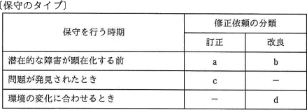
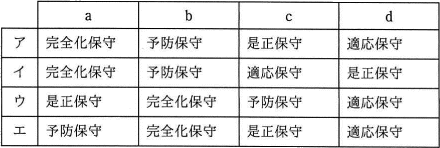
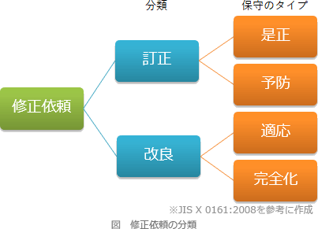

# [令和2年秋期 午前 問48](https://www.ap-siken.com/kakomon/02_aki/q48.html)

#問題 #テクノロジ #システム開発技術 #保守・廃棄

解説を表示解説を隠す

<strong>問48</strong>　ソフトウェア保守で修正依頼を保守のタイプに分けるとき，次のa～dに該当する保守のタイプの，適切な組合せはどれか。  

<ul class="ap-choices">
<li class="ap-choice-item ap-wrong">

ア

a～dと保守タイプの組合せが誤っています。組合せは選択肢表を参照してください。

</li>
<li class="ap-choice-item ap-wrong">

イ

a～dと保守タイプの組合せが誤っています。組合せは選択肢表を参照してください。

</li>
<li class="ap-choice-item ap-wrong">

ウ

a～dと保守タイプの組合せが誤っています。組合せは選択肢表を参照してください。

</li>
<li class="ap-choice-item ap-correct">

エ

正しい。a＝<a href="用語/予防保守" class="internal-link" data-href="用語/予防保守">予防保守</a>、b＝<a href="用語/完全化保守" class="internal-link" data-href="用語/完全化保守">完全化保守</a>、c＝<a href="用語/是正保守" class="internal-link" data-href="用語/是正保守">是正保守</a>、d＝<a href="用語/適応保守" class="internal-link" data-href="用語/適応保守">適応保守</a>の組合せです。

</li>
</ul>

<h4>解説</h4>

JIS X 0161によれば、システムやソフトウェアに対する保守は、その目的により、「訂正」の性質をもつ<a href="用語/是正保守" class="internal-link" data-href="用語/是正保守">是正保守</a>と<a href="用語/予防保守" class="internal-link" data-href="用語/予防保守">予防保守</a>、「改良」の性質をもつ<a href="用語/適応保守" class="internal-link" data-href="用語/適応保守">適応保守</a>と<a href="用語/完全化保守" class="internal-link" data-href="用語/完全化保守">完全化保守</a>の4つの類型に分けられます。

<ul>
<li><a href="用語/是正保守" class="internal-link" data-href="用語/是正保守">是正保守</a> … ソフトウェア製品の引渡し後に発見された問題を訂正するために行う受身の修正</li>
<li><a href="用語/予防保守" class="internal-link" data-href="用語/予防保守">予防保守</a> … 引渡し後のソフトウェア製品の潜在的な障害が運用障害になる前に発見し、是正を行うための修正</li>
<li><a href="用語/適応保守" class="internal-link" data-href="用語/適応保守">適応保守</a> … 引渡し後、変化した又は変化している環境において、ソフトウェア製品を使用できるように保ち続けるために実施する修正</li>
<li><a href="用語/完全化保守" class="internal-link" data-href="用語/完全化保守">完全化保守</a> … 引渡し後のソフトウェア製品のパフォーマンスや<a href="用語/保守性" class="internal-link" data-href="用語/保守性">保守性</a>を向上させるための修正。機能追加や変更、性能強化、プログラム文書の改善などを含む</li>
</ul>

訂正を目的とする保守のうち、(c)発見された問題に対して行うのが<a href="用語/是正保守" class="internal-link" data-href="用語/是正保守">是正保守</a>、(a)潜在化しているうちに問題を訂正するのが<a href="用語/予防保守" class="internal-link" data-href="用語/予防保守">予防保守</a>です。また、改良を目的とする保守のうち、(d)環境の変化に合わせるために行うのが<a href="用語/適応保守" class="internal-link" data-href="用語/適応保守">適応保守</a>、(b)潜在的な障害を見つけ改良を行うのが<a href="用語/完全化保守" class="internal-link" data-href="用語/完全化保守">完全化保守</a>です。

したがって、a＝<a href="用語/予防保守" class="internal-link" data-href="用語/予防保守">予防保守</a>、b＝<a href="用語/完全化保守" class="internal-link" data-href="用語/完全化保守">完全化保守</a>、c＝<a href="用語/是正保守" class="internal-link" data-href="用語/是正保守">是正保守</a>、d＝<a href="用語/適応保守" class="internal-link" data-href="用語/適応保守">適応保守</a>である「エ」の組合せが適切です。

