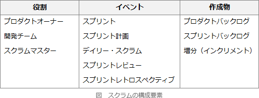

# [令和2年秋期 午前 問49](https://www.ap-siken.com/kakomon/02_aki/q49.html)

#問題 #テクノロジ #ソフトウェア開発管理技術 #開発プロセス・手法

解説を表示解説を隠す

<strong>問49</strong>　アジャイル開発手法の説明のうち，スクラムのものはどれか。

<ul class="ap-choices">
<li class="ap-choice-item ap-wrong">

ア　コミュニケーション，シンプル，フィードバック，勇気，尊重の五つの価値を基礎とし，テスト駆動型開発，ペアプログラミング，リファクタリングなどのプラクティスを推奨する。

これは<a href="用語/XP" class="internal-link" data-href="用語/XP">XP</a>(エクストリームプログラミング)の説明です。

</li>
<li class="ap-choice-item ap-wrong">

イ　推測(プロジェクト立上げ，適応的サイクル計画)，協調(並行コンポーネント開発)，学習(品質レビュー，最終QA／リリース)のライフサイクルをもつ。

これは適応型ソフトウェア開発(Adaptive Software Development：ASD)の説明です。

</li>
<li class="ap-choice-item ap-correct">

ウ　プロダクトオーナーなどの役割，スプリントレビューなどのイベント，プロダクトバックログなどの作成物，及びルールから成るソフトウェア開発のフレームワークである。

正しい。<a href="用語/スクラム" class="internal-link" data-href="用語/スクラム">スクラム</a>の説明です。

</li>
<li class="ap-choice-item ap-wrong">

エ　モデルの全体像を作成した上で，優先度を付けた詳細なフィーチャリストを作成し，フィーチャを単位として計画し，フィーチャ単位に設計と構築を繰り返す。

これはフィーチャ駆動開発(Feature Driven Development：FDD)の説明です。<a href="用語/ユーザー機能駆動開発" class="internal-link" data-href="用語/ユーザー機能駆動開発">ユーザー機能駆動開発</a>とも呼ばれます。

</li>
</ul>

<h4>解説</h4>

<a href="用語/スクラム" class="internal-link" data-href="用語/スクラム">スクラム</a>は、<a href="用語/アジャイル" class="internal-link" data-href="用語/アジャイル">アジャイル</a>開発の方法論の1つで、開発プロジェクトを数週間程度の短期間ごとに区切り、その期間内に分析、設計、実装、テストの一連の活動を行い、一部分の機能を完成させるという作業を繰り返しながら、段階的に動作可能なシステムを作り上げるフレームワークです。<a href="用語/スクラム" class="internal-link" data-href="用語/スクラム">スクラム</a>開発では開発反復の単位を「<a href="用語/スプリント" class="internal-link" data-href="用語/スプリント">スプリント</a>」といいます。

<a href="用語/スクラム" class="internal-link" data-href="用語/スクラム">スクラム</a>では、<a href="用語/スクラムチーム" class="internal-link" data-href="用語/スクラムチーム">スクラムチーム</a>を構成するプロダクトオーナー・開発チーム・スクラムマスターの役割、並びに5つのイベントと3つの作成物が定義されています。

