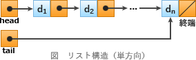

# [令和2年秋期 午前 問5](https://www.ap-siken.com/kakomon/02_aki/q5.html)

#問題 #テクノロジ #アルゴリズムとプログラミング #データ構造

解説を表示解説を隠す

<strong>問5</strong>　ポインタを用いた線形リストの特徴のうち，適切なものはどれか。

<ul class="ap-choices">
<li class="ap-choice-item ap-wrong">

ア　先頭の要素を根としたn分木で，先頭以外の要素は全て先頭の要素の子である。

<a href="用語/木構造" class="internal-link" data-href="用語/木構造">木構造</a>の説明です。<a href="用語/線形リスト" class="internal-link" data-href="用語/線形リスト">線形リスト</a>ではデータ同士に親子関係はありません。

</li>
<li class="ap-choice-item ap-wrong">

イ　配列を用いた場合と比較して，2分探索を効率的に行うことが可能である。

<a href="用語/線形リスト" class="internal-link" data-href="用語/線形リスト">線形リスト</a>は隣接する要素同士がポインタで接続されているため、データを先頭から順に探索していく線形探索に適しています。2分探索を行うのに適した<a href="用語/データ構造" class="internal-link" data-href="用語/データ構造">データ構造</a>は要素が値の大小で整列されている<a href="用語/2分探索木" class="internal-link" data-href="用語/2分探索木">2分探索木</a>です。

</li>
<li class="ap-choice-item ap-wrong">

ウ　ポインタから次の要素を求めるためにハッシュ関数を用いる。

ポインタとは次の要素が格納されている<a href="用語/メモリ" class="internal-link" data-href="用語/メモリ">メモリ</a>アドレスの情報です。次の要素を得るにはポインタが指し示す<a href="用語/メモリ" class="internal-link" data-href="用語/メモリ">メモリ</a>上のデータを読み込みます。

</li>
<li class="ap-choice-item ap-correct">

エ　ポインタによって指定されている要素の後ろに，新たな要素を追加する計算量は，要素の個数や位置によらず一定である。

正しい。<a href="用語/単方向リスト" class="internal-link" data-href="用語/単方向リスト">単方向リスト</a>の場合は新たな要素の追加は以下の手順で行われます。(1)ポインタで指定された要素(以降、元要素)を取得する (2)元要素のポインタを新要素のポインタに付け替える (3)元要素のポインタが新要素を指し示すようにする。元要素の取得後、その要素の後ろに新たな要素を追加する計算量は、<a href="用語/リスト" class="internal-link" data-href="用語/リスト">リスト</a>の要素の個数や追加する位置によらず一定です。

</li>
</ul>

<h4>解説</h4>

<a href="用語/線形リスト" class="internal-link" data-href="用語/線形リスト">線形リスト</a>とは、線形で表現される<a href="用語/リスト" class="internal-link" data-href="用語/リスト">リスト</a>構造の総称で、一般的には隣接するデータ同士をポインタで連結して表現します。

<a href="用語/単方向リスト" class="internal-link" data-href="用語/単方向リスト">単方向リスト</a>では、ポインタで指定された要素(元要素)の取得後、その要素の後ろに新たな要素を追加する計算量は、<a href="用語/リスト" class="internal-link" data-href="用語/リスト">リスト</a>の要素の個数や追加する位置によらず一定です。一方、<a href="用語/配列" class="internal-link" data-href="用語/配列">配列</a>の場合は追加する位置以後の要素を1つずつ後ろにシフトしなければなりません。

