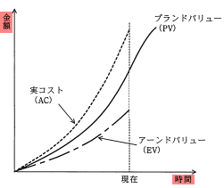

# [令和2年秋期 午前 問52](https://www.ap-siken.com/kakomon/02_aki/q52.html)

#問題 #マネジメント #プロジェクトマネジメント #プロジェクトの時間

解説を表示解説を隠す

<strong>問52</strong>　プロジェクトマネジメントにおいてパフォーマンス測定に使用するEVMの管理対象の組みはどれか。

<ul class="ap-choices">
<li class="ap-choice-item ap-correct">

ア　コスト，スケジュール

正しい。<a href="用語/EVM" class="internal-link" data-href="用語/EVM">EVM</a>は作業を金銭の価値に置き換え、<a href="用語/コスト" class="internal-link" data-href="用語/コスト">コスト</a>と<a href="用語/スケジュール" class="internal-link" data-href="用語/スケジュール">スケジュール</a>を定量的に管理する。

</li>
<li class="ap-choice-item ap-wrong">

イ　コスト，リスク

<a href="用語/EVM" class="internal-link" data-href="用語/EVM">EVM</a>は<a href="用語/リスク" class="internal-link" data-href="用語/リスク">リスク</a>を直接管理する手法ではない。

</li>
<li class="ap-choice-item ap-wrong">

ウ　スケジュール，品質

<a href="用語/EVM" class="internal-link" data-href="用語/EVM">EVM</a>は<a href="用語/品質" class="internal-link" data-href="用語/品質">品質</a>を直接管理する手法ではない。

</li>
<li class="ap-choice-item ap-wrong">

エ　品質，リスク

<a href="用語/品質" class="internal-link" data-href="用語/品質">品質</a>と<a href="用語/リスク" class="internal-link" data-href="用語/リスク">リスク</a>は<a href="用語/EVM" class="internal-link" data-href="用語/EVM">EVM</a>の管理対象ではない。

</li>
</ul>

<h4>解説</h4>

<a href="用語/EVM" class="internal-link" data-href="用語/EVM">EVM</a>（Earned Value Management）は、プロジェクトにおける作業を金銭の価値に置き換えて、<a href="用語/コスト" class="internal-link" data-href="用語/コスト">コスト</a>と<a href="用語/スケジュール" class="internal-link" data-href="用語/スケジュール">スケジュール</a>の2つを定量的に管理する<a href="用語/進捗管理" class="internal-link" data-href="用語/進捗管理">進捗管理</a>手法です。

<a href="用語/EVM" class="internal-link" data-href="用語/EVM">EVM</a>では予算値と実績値からPV、EV、ACの各指標を算出し、それぞれを比較することで<a href="用語/コスト" class="internal-link" data-href="用語/コスト">コスト</a>差異と<a href="用語/スケジュール" class="internal-link" data-href="用語/スケジュール">スケジュール</a>差異を把握します。したがって「ア」の組合せが適切です。

