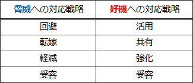

# [令和2年秋期 午前 問54](https://www.ap-siken.com/kakomon/02_aki/q54.html)

#問題 #マネジメント #プロジェクトマネジメント #プロジェクトのリスク

解説を表示解説を隠す

<strong>問54</strong>　PMBOKガイド第6版によれば，脅威と好機の，どちらに対しても採用されるリスク対応戦略として，適切なものはどれか。

<ul class="ap-choices">
<li class="ap-choice-item ap-wrong">

ア　回避

<a href="用語/脅威" class="internal-link" data-href="用語/脅威">脅威</a>への対応戦略であり、好機には使わない。

</li>
<li class="ap-choice-item ap-wrong">

イ　共有

好機への対応戦略であり、<a href="用語/脅威" class="internal-link" data-href="用語/脅威">脅威</a>には使わない。

</li>
<li class="ap-choice-item ap-correct">

ウ　受容

正しい。<a href="用語/脅威" class="internal-link" data-href="用語/脅威">脅威</a>・好機のどちらにも採用される<a href="用語/リスクへの対応" class="internal-link" data-href="用語/リスクへの対応">リスクへの対応</a>戦略。

</li>
<li class="ap-choice-item ap-wrong">

エ　転嫁

<a href="用語/脅威" class="internal-link" data-href="用語/脅威">脅威</a>への対応戦略であり、好機には使わない。

</li>
</ul>

<h4>解説</h4>

<a href="用語/PMBOK" class="internal-link" data-href="用語/PMBOK">PMBOK</a>によれば、<a href="用語/プロジェクト" class="internal-link" data-href="用語/プロジェクト">プロジェクト</a>にマイナスの影響を与える<a href="用語/リスク" class="internal-link" data-href="用語/リスク">リスク</a>（<a href="用語/脅威" class="internal-link" data-href="用語/脅威">脅威</a>）への対応戦略には「回避」「転嫁」「軽減」「受容」の4種類があります。

<ul>
<li>回避：<a href="用語/リスク" class="internal-link" data-href="用語/リスク">リスク</a>そのものの除去や、<a href="用語/プロジェクト" class="internal-link" data-href="用語/プロジェクト">プロジェクト</a>の<a href="用語/スコープ" class="internal-link" data-href="用語/スコープ">スコープ</a>や目標を縮小・変更するなどして<a href="用語/リスク" class="internal-link" data-href="用語/リスク">リスク</a>の影響をゼロにする戦略</li>
<li>転嫁：<a href="用語/リスク" class="internal-link" data-href="用語/リスク">リスク</a>のある業務・作業の<a href="用語/アウトソーシング" class="internal-link" data-href="用語/アウトソーシング">アウトソーシング</a>や、損害保険の契約によって<a href="用語/リスク" class="internal-link" data-href="用語/リスク">リスク</a>によるマイナスの影響を第三者へ移転する戦略</li>
<li>軽減：<a href="用語/リスク" class="internal-link" data-href="用語/リスク">リスク</a>の影響範囲を狭くしたり、発生確率を低減したりする戦略</li>
<li>受容：<a href="用語/リスク" class="internal-link" data-href="用語/リスク">リスク</a>が現実化した時の影響が許容可能範囲内である場合や<a href="用語/リスク" class="internal-link" data-href="用語/リスク">リスク</a>の除去が困難であるときに、特に対策をせずにそのままにしておく戦略。対策費用が予想される損失金額を上回っているときなどに採られる</li>
</ul>

逆に<a href="用語/プロジェクト" class="internal-link" data-href="用語/プロジェクト">プロジェクト</a>にプラスの影響を与える<a href="用語/リスク" class="internal-link" data-href="用語/リスク">リスク</a>（好機）への対応戦略にも「活用」「共有」「強化」「受容」の4種類があります。

<ul>
<li>活用：好機が確実に到来するように、顕在化の不確実性を取り除くための戦略</li>
<li>共有：好機を得られる能力の高い第三者に<a href="用語/プロジェクト" class="internal-link" data-href="用語/プロジェクト">プロジェクト</a>の実行権限の一部、または全部を与える戦略</li>
<li>強化：好機のプラスの影響を増加させたり、その発生確率を高めたりする戦略</li>
<li>受容：積極的な利用はしないが、好機が実現したときにはその利益を享受しようとする戦略。対策費用が予想される利得を上回っているときなどに採られる</li>
</ul>

設問では、どちらの<a href="用語/リスク" class="internal-link" data-href="用語/リスク">リスク</a>に対しても採用される<a href="用語/リスクへの対応" class="internal-link" data-href="用語/リスクへの対応">リスクへの対応</a>戦略を問われているため「受容」が正解です。

