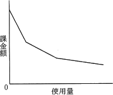
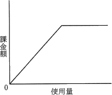
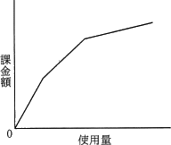
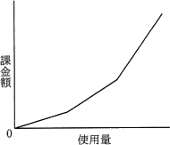

# [令和2年秋期 午前 問55](https://www.ap-siken.com/kakomon/02_aki/q55.html)

#問題 #マネジメント #サービスマネジメント #サービスの運用

解説を表示解説を隠す

<strong>問55</strong>　ITサービスにおけるコンピュータシステムの利用に対する課金を逓減課金方式にしたときのグラフはどれか。ここでグラフの縦軸は累計の課金額を示す。

<ul class="ap-choices">
<li class="ap-choice-item ap-wrong">

ア　

使用量が増えるほど累計の<a href="用語/課金" class="internal-link" data-href="用語/課金">課金</a>額が減っていくグラフであり、逓減<a href="用語/課金" class="internal-link" data-href="用語/課金">課金</a>方式ではない。

</li>
<li class="ap-choice-item ap-wrong">

イ　

使用量に比例して<a href="用語/課金" class="internal-link" data-href="用語/課金">課金</a>額が上がり、一定の閾値を超えるとそれ以上は上がらない。<a href="用語/従量制" class="internal-link" data-href="用語/従量制">従量制</a>に上限を設けた従量<a href="用語/課金" class="internal-link" data-href="用語/課金">課金</a>上限制（キャップ制）のグラフである。

</li>
<li class="ap-choice-item ap-correct">

ウ　

正しい。累積使用量が増えるほど<a href="用語/課金" class="internal-link" data-href="用語/課金">課金</a>額の増加量がなだらかになる逓減<a href="用語/課金" class="internal-link" data-href="用語/課金">課金</a>方式のグラフである。

</li>
<li class="ap-choice-item ap-wrong">

エ　

累積使用量が増えるほど利用単位当たりの料金が高くなり、<a href="用語/課金" class="internal-link" data-href="用語/課金">課金</a>額の増加量が大きくなる。逓増<a href="用語/課金" class="internal-link" data-href="用語/課金">課金</a>方式のグラフである。

</li>
</ul>

<h4>解説</h4>

逓減（ていげん）<a href="用語/課金" class="internal-link" data-href="用語/課金">課金</a>方式とは、システムの累積使用量が増加するに従って利用単位当たりの<a href="用語/課金" class="internal-link" data-href="用語/課金">課金</a>額が減っていく、つまり使えば使うほど割安な単価で利用できるようになっていく<a href="用語/課金" class="internal-link" data-href="用語/課金">課金</a>方式のことです。例えば、100回までのサービス使用は1回100円、100回を超えて500回までは1回70円、500回を超えると1回50円というような感じです。

この逓減<a href="用語/課金" class="internal-link" data-href="用語/課金">課金</a>方式における使用量と<a href="用語/課金" class="internal-link" data-href="用語/課金">課金</a>額の関係をグラフにすると、累積使用量が多くなるほど<a href="用語/課金" class="internal-link" data-href="用語/課金">課金</a>額の増加量がなだらかに減っていく「ウ」のような形状になります。

