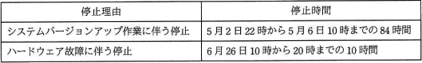

# [令和2年秋期 午前 問56](https://www.ap-siken.com/kakomon/02_aki/q56.html)

#問題 #マネジメント #サービスマネジメント #サービスマネジメントプロセス

解説を表示解説を隠す

<strong>問56</strong>　サービス提供時間帯が毎日0～24時のITサービスにおいて，ある年の4月1日0時から6月30日24時までのシステム停止状況は表のとおりであった。システムバージョンアップ作業に伴う停止時間は，計画停止時間として顧客との間で合意されている。このとき，4月1日から6月30日までのITサービスの可用性は何%か。ここで，可用性(%)は小数第3位を四捨五入するものとする。  〔サービス停止状況〕 

<ul class="ap-choices">
<li class="ap-choice-item ap-wrong">

ア　95.52

計画停止時間を計画<a href="用語/サービス時間" class="internal-link" data-href="用語/サービス時間">サービス時間</a>から差し引かずに<a href="用語/可用性" class="internal-link" data-href="用語/可用性">可用性</a>を求めた誤答です。

</li>
<li class="ap-choice-item ap-wrong">

イ　95.70

計画停止時間を分母に含めたまま<a href="用語/可用性" class="internal-link" data-href="用語/可用性">可用性</a>を計算した誤答です（2,090÷2,184≒95.70%）。

</li>
<li class="ap-choice-item ap-correct">

ウ　99.52

正しい。計画<a href="用語/サービス時間" class="internal-link" data-href="用語/サービス時間">サービス時間</a>2,100時間に対し実<a href="用語/サービス時間" class="internal-link" data-href="用語/サービス時間">サービス時間</a>2,090時間なので、2,090÷2,100≒99.52%となる。

</li>
<li class="ap-choice-item ap-wrong">

エ　99.63

計画停止時間の扱いや端数処理の前提が異なる誤答です。

</li>
</ul>

<h4>解説</h4>

サービスの<a href="用語/可用性" class="internal-link" data-href="用語/可用性">可用性</a>は以下の式で算出されます。

<a href="用語/可用性" class="internal-link" data-href="用語/可用性">可用性</a>＝(計画<a href="用語/サービス時間" class="internal-link" data-href="用語/サービス時間">サービス時間</a>－停止時間)÷計画<a href="用語/サービス時間" class="internal-link" data-href="用語/サービス時間">サービス時間</a>

計画<a href="用語/サービス時間" class="internal-link" data-href="用語/サービス時間">サービス時間</a>＝サービス提供時間－計画停止時間

式に従って、まずは計画<a href="用語/サービス時間" class="internal-link" data-href="用語/サービス時間">サービス時間</a>を求めます。サービス提供時間帯は毎日0時～24時、各月の末日は、4月30日、5月31日、6月30日ですので、サービス提供時間は、

24時間×(30日＋31日＋30日)＝2,184時間

さらにシステム停止時間のうち「システムバージョンアップ作業に伴う停止」は計画停止に該当しますので、サービス提供時間から差し引きます。

2,184時間－84時間＝2,100時間

よって、計画<a href="用語/サービス時間" class="internal-link" data-href="用語/サービス時間">サービス時間</a>は2,100時間となります。

この時間からハードウェア故障の10時間を除いた2,090時間が<a href="用語/サービス時間" class="internal-link" data-href="用語/サービス時間">サービス時間</a>の実績値になります。以上より<a href="用語/可用性" class="internal-link" data-href="用語/可用性">可用性</a>(%)は、

2,090時間÷2,100時間＝0.99523…＝99.523…%

小数第3位を四捨五入して99.52%

したがって「ウ」が正解です。

