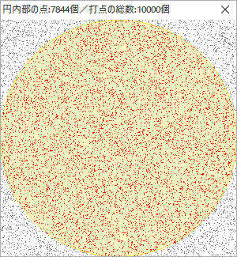

# [令和2年秋期 午前 問6](https://www.ap-siken.com/kakomon/02_aki/q6.html)

#問題 #テクノロジ #アルゴリズムとプログラミング #アルゴリズム

解説を表示解説を隠す

<strong>問6</strong>　円周率πの値を近似的に求める方法のうち，モンテカルロ法を応用したものはどれか。

<ul class="ap-choices">
<li class="ap-choice-item ap-correct">

ア　正方形の中に一様乱数を用いて多数の点をとったとき，その点の個数と正方形に内接する円の中にある点の個数の比が，点の個数を多くすると両者の面積比である4:πに近づくことを用いて求める。

正しい。一様乱数で打点し，内接円内の点の割合から面積比を近似するのが<a href="用語/モンテカルロ法" class="internal-link" data-href="用語/モンテカルロ法">モンテカルロ法</a>の典型例です。

</li>
<li class="ap-choice-item ap-wrong">

イ　正方形の中に等間隔に多数の格子点をとったとき，その格子点の個数と正方形に内接する円の中にある格子点の個数の比が，格子点の間隔を細かくすると両者の面積比である4:πに近づくことを用いて求める。

格子点は等間隔に配置する手法であり，一様乱数による試行ではないため<a href="用語/モンテカルロ法" class="internal-link" data-href="用語/モンテカルロ法">モンテカルロ法</a>ではありません。

</li>
<li class="ap-choice-item ap-wrong">

ウ　直径1の円に内接する正n角形の周の長さと円の直径の比が，nを大きくするとπ:1に近づくことを用いて求める。

正n角形の周長から円周率を求める古典的な近似であり，乱数による<a href="用語/シミュレーション" class="internal-link" data-href="用語/シミュレーション">シミュレーション</a>ではありません。

</li>
<li class="ap-choice-item ap-wrong">

エ　直径1の円に内接する正n角形の面積と円に内接する正方形の面積の比が，nを大きくするとπ:2に近づくことを用いて求める。

正n角形の面積比から円周率を求める近似であり，乱数による<a href="用語/シミュレーション" class="internal-link" data-href="用語/シミュレーション">シミュレーション</a>ではありません。

</li>
</ul>

<h4>解説</h4>

<a href="用語/モンテカルロ法" class="internal-link" data-href="用語/モンテカルロ法">モンテカルロ法</a>は、数値解析の分野において、確率を近似的に求めるために使われる手法です。乱数によるn回の<a href="用語/シミュレーション" class="internal-link" data-href="用語/シミュレーション">シミュレーション</a>を行い、ある事象がm回起これば、その事象の起こる確率は m／nで近似できます。試行回数nが大きくなるほどよりよい近似値を得ることができます。

<a href="用語/モンテカルロ法" class="internal-link" data-href="用語/モンテカルロ法">モンテカルロ法</a>は一様乱数を用いることが特徴なので正解は「ア」です。

<a href="用語/モンテカルロ法" class="internal-link" data-href="用語/モンテカルロ法">モンテカルロ法</a>の例としてよく用いられるのが円周率の近似値を求める方法で、正方形内に乱数を用いて多数の点を打ち、「内接円内にある点の数／点を打った数」を計算することで円の面積を近似的に求め、そこから円周率を導きます。

以下は、プログラムを組んで正方形内へのランダムな打点を10,000回繰り返した結果です。正方形の面積を1とすると内接円の面積は、 0.5×0.5×π＝0.25π＝π/4≒0.785 ですから、10,000回試行に対して内接円の内部の点の数が7,844個という結果は、正方形と内接円の面積比を概ね正確に表していると言えます。

