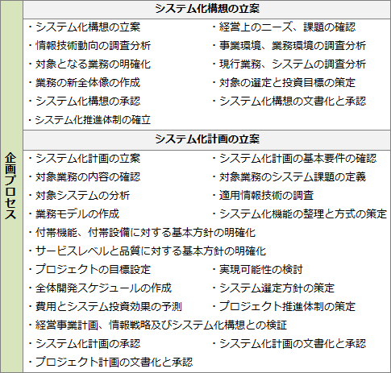

# [令和2年秋期 午前 問62](https://www.ap-siken.com/kakomon/02_aki/q62.html)

#問題 #ストラテジ #システム企画 #システム化計画

解説を表示解説を隠す

<strong>問62</strong>　共通フレーム2013によれば，企画プロセスで実施すべきものはどれか。

<ul class="ap-choices">
<li class="ap-choice-item ap-correct">

ア　市場，競合など事業環境を分析し，企業の情報戦略と事業目標の関係を明確にする。

正しい。企画プロセスで実施される作業です。

</li>
<li class="ap-choice-item ap-wrong">

イ　システムのライフサイクルの全期間を通して，システムの利害関係者を識別する。

要件定義プロセスの「利害関係者の識別」で実施される作業です。

</li>
<li class="ap-choice-item ap-wrong">

ウ　人間の能力及びスキルの限界を考慮して，利用者とシステムとの間の相互作用を識別する。

要件定義プロセスの「要件の識別」で実施される作業です。

</li>
<li class="ap-choice-item ap-wrong">

エ　利害関係者の要件が正確に表現されていることを，利害関係者とともに確立する。

要件定義プロセスの「要件の合意」で実施される作業です。

</li>
</ul>

<h4>解説</h4>

企画プロセスは，経営事業の目的・目標を達成するために必要とされるシステムに対する基本方針をまとめ，実施計画を得るプロセスです。システム化構想の立案，システム化計画の立案という2つの<a href="用語/アクティビティ" class="internal-link" data-href="用語/アクティビティ">アクティビティ</a>で構成されます。

システム化構想の立案は，<a href="用語/経営課題" class="internal-link" data-href="用語/経営課題">経営課題</a>を解決するための新たな業務とシステムの構想を立案します。システム化計画の立案は，システム化構想を具現化するための，システム化計画及びプロジェクト計画を具体化し，<a href="用語/利害関係者の合意" class="internal-link" data-href="用語/利害関係者の合意">利害関係者の合意</a>を得ます。

「ア」の<a href="用語/事業環境" class="internal-link" data-href="用語/事業環境">事業環境</a>の分析はシステムの構想を練る際に必要な作業と考えられるので，これが企画プロセスで実施する作業です。「ア」の記述は，システム化構想の立案の「<a href="用語/事業環境" class="internal-link" data-href="用語/事業環境">事業環境</a>，<a href="用語/業務環境" class="internal-link" data-href="用語/業務環境">業務環境</a>の調査分析」で取り組む内容として規定されています。

「イ」は要件定義プロセスの「利害関係者の識別」，「ウ」は「要件の識別」，「エ」は「要件の合意」で実施される作業です。

正解は「ア」です。

