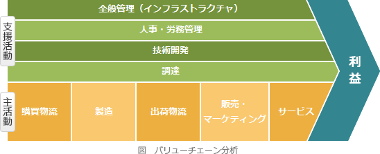

# [令和2年秋期 午前 問67](https://www.ap-siken.com/kakomon/02_aki/q67.html)

#問題 #ストラテジ #経営戦略マネジメント #経営戦略手法

解説を表示解説を隠す

<strong>問67</strong>　企業の事業活動を機能ごとに主活動と支援活動に分け，企業が顧客に提供する製品やサービスの利益は，どの活動で生み出されているかを分析する手法はどれか。

<ul class="ap-choices">
<li class="ap-choice-item ap-wrong">

ア　3C分析

<a href="用語/3C分析" class="internal-link" data-href="用語/3C分析">3C分析</a>は，マーケティング分析に必要不可欠な3要素「顧客(Customer)」「自社(Company)」「競合他社(Competitor)」について自社の置かれている状況を分析する手法です。

</li>
<li class="ap-choice-item ap-wrong">

イ　SWOT分析

SWOT分析は，企業の置かれている経営環境を分析し，今後の戦略立案に活かす方法の一つです。内部要因である"強み"・"弱み"と外部要因である"機会"・"脅威"に分けて分析します。

</li>
<li class="ap-choice-item ap-correct">

ウ　バリューチェーン分析

正しい。事業活動を主活動と支援活動に分け，利益がどの活動で生み出されているかを分析する手法です。

</li>
<li class="ap-choice-item ap-wrong">

エ　ファイブフォース分析

<a href="用語/ファイブフォース分析" class="internal-link" data-href="用語/ファイブフォース分析">ファイブフォース分析</a>は，業界の収益性を決める5つの競争要因から，業界の構造分析をおこなう手法のことです。

</li>
</ul>

<h4>解説</h4>

バリューチェーン分析は，業務を「購買物流」「製造」「出荷物流」「販売・マーケティング」「サービス」という5つの主活動と，「調達」「技術開発」「人事・労務管理」「全般管理」の4つの支援活動に分類し，製品の<a href="用語/付加価値" class="internal-link" data-href="用語/付加価値">付加価値</a>がどの部分（機能）で生み出されているかを分析する手法です。事業活動を価値創造活動の集合と捉え，その価値の連鎖を分析することによって競合他社と比較した自社の強みと弱みを明らかにしたり，業務の最適化を図ろうとする目的があります。

「ア」の<a href="用語/3C分析" class="internal-link" data-href="用語/3C分析">3C分析</a>は，顧客・自社・競合の3要素について状況を分析する手法です。「イ」のSWOT分析は，強み・弱み・機会・脅威に分けて経営環境を分析する手法です。「エ」の<a href="用語/ファイブフォース分析" class="internal-link" data-href="用語/ファイブフォース分析">ファイブフォース分析</a>は，供給企業の交渉力・買い手の交渉力・競争企業間の敵対関係・新規参入者の脅威・代替品の脅威の5要因から業界構造を分析する手法です。

正解は「ウ」です。

