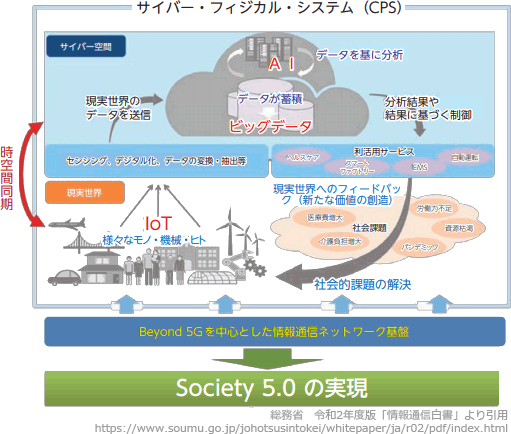

# [令和2年秋期 午前 問71](https://www.ap-siken.com/kakomon/02_aki/q71.html)

#問題 #ストラテジ #ビジネスインダストリ #ビジネスシステム

解説を表示解説を隠す

<strong>問71</strong>　CPS(サイバーフィジカルシステム)を活用している事例はどれか。

<ul class="ap-choices">
<li class="ap-choice-item ap-wrong">

ア　仮想化された標準的なシステム資源を用意しておき，業務内容に合わせてシステムの規模や構成をソフトウェアによって設定する。

<a href="用語/仮想化" class="internal-link" data-href="用語/仮想化">仮想化</a>技術の活用事例です。

</li>
<li class="ap-choice-item ap-wrong">

イ　機器を販売するのではなく貸し出し，その機器に組み込まれたセンサーで使用状況を検知し，その情報を元に利用者から利用料金を徴収する。

<a href="用語/IoT" class="internal-link" data-href="用語/IoT">IoT</a>の活用事例です。

</li>
<li class="ap-choice-item ap-wrong">

ウ　業務処理機能やデータ蓄積機能をサーバにもたせ，クライアント側はネットワーク接続と最小限の入出力機能だけをもたせてデスクトップの仮想化を行う。

<a href="用語/シンクライアント" class="internal-link" data-href="用語/シンクライアント">シンクライアント</a>の活用事例です。

</li>
<li class="ap-choice-item ap-correct">

エ　現実世界の都市の構造や活動状況のデータによって仮想世界を構築し，災害の発生や時間軸を自由に操作して，現実世界では実現できないシミュレーションを行う。

正しい。<a href="用語/サイバーフィジカルシステム" class="internal-link" data-href="用語/サイバーフィジカルシステム">サイバーフィジカルシステム</a>の活用事例です。本肢のように、コンピュータ上の仮想空間に現実空間の複製を用意し、その中でシミュレーションや将来予測を行う技術を<a href="用語/デジタルツイン" class="internal-link" data-href="用語/デジタルツイン">デジタルツイン</a>と言います。

</li>
</ul>

<h4>解説</h4>

<a href="用語/サイバーフィジカルシステム" class="internal-link" data-href="用語/サイバーフィジカルシステム">サイバーフィジカルシステム</a>は、サイバー空間(仮想空間)とフィジカル空間(現実空間)を高度に融合させたシステムです。フィジカル空間を<a href="用語/センサー" class="internal-link" data-href="用語/センサー">センサー</a>で捉えた情報をサイバー空間に集積し、サイバー空間に配置されたAI等で処理された結果をフィジカル空間にフィードバックすることにより、これまでにはできなかった新たな価値を産業や社会にもたらすことが期待されています。日本政府が目指す<a href="用語/Society5.0" class="internal-link" data-href="用語/Society5.0">Society5.0</a>を実現するための基幹技術です。

