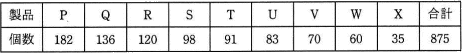

# [令和2年秋期 午前 問74](https://www.ap-siken.com/kakomon/02_aki/q74.html)

#問題 #ストラテジ #企業活動 #業務分析・データ利活用

解説を表示解説を隠す

<strong>問74</strong>　不良品の個数を製品別に集計すると表のようになった。ABC分析を行って，まずA群の製品に対策を講じることにした。A群の製品は何種類か。ここで，A群は70%以上とする。 

<ul class="ap-choices">
<li class="ap-choice-item ap-wrong">

ア　3

上位3製品の累計個数では、A群のしきい値（全体の70%以上）に達しません。

</li>
<li class="ap-choice-item ap-wrong">

イ　4

上位4製品の累計個数では、A群のしきい値に達しません。

</li>
<li class="ap-choice-item ap-correct">

ウ　5

正しい。個数の多い順に累計し、70%以上となる製品は5種類です。

</li>
<li class="ap-choice-item ap-wrong">

エ　6

6製品まで含めると、A群の範囲（70%以上）を超えてしまいます。

</li>
</ul>

<h4>解説</h4>

<a href="用語/ABC分析" class="internal-link" data-href="用語/ABC分析">ABC分析</a>は、重要度や優先度の高い要素・項目を明らかにするために行われる分析手法です。<a href="用語/パレート図" class="internal-link" data-href="用語/パレート図">パレート図</a>を使って分析する要素・項目群を大きい順に並べ、上位70%を占める要素群をA、70%～90%の要素群をB、それ以外の要素群をCとしてグルーピングすることで重点的に管理すべきグループがどれであるかを明らかにできます。

表の個数合計は875個なので、Aグループ(70%以上)のしきい値となる個数は、875×0.7＝612.5。小数点を切り上げると613個以上になります。表は左から項目の大きい順に整列済みですので、613個以上となるまで足し合わせていけばよいだけです。

182＋136＝318 182＋136＋120＝438 182＋136＋120＋98＝536 182＋136＋120＋98＋91＝627

項目数の大きい製品から5つ足し合わせたところでグループの個数が613個(全体の70％)以上となるので、A群に含まれる製品は5種類です。正解は「ウ」です。

