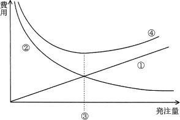
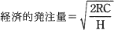
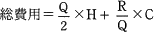
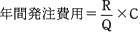
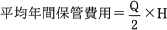
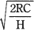
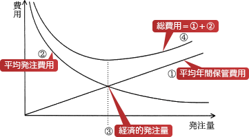

# [令和2年秋期 午前 問75](https://www.ap-siken.com/kakomon/02_aki/q75.html)

#問題 #ストラテジ #企業活動 #業務分析・データ利活用

解説を表示解説を隠す

<strong>問75</strong>　図は，定量発注方式を運用する際の費用と発注量の関係を示したものである。図中の③を表しているものはどれか。ここで， 1回当たりの発注量をQ，1回当たりの発注費用をC，1単位当たりの年間保管費用をH，年間需要量をRとする。また，選択肢ア～エのそれぞれの関係式は成り立っている。 

<ul class="ap-choices">
<li class="ap-choice-item ap-correct">

ア　

正しい。図を見ると、平均<a href="用語/発注費用" class="internal-link" data-href="用語/発注費用">発注費用</a>と平均年間保管費用が一致するとき、総費用が最も低くなっています。定量発注方式において総費用が最も安くなる発注量を「経済的発注量」といいます。

</li>
<li class="ap-choice-item ap-wrong">

イ　

総費用は、②平均<a href="用語/発注費用" class="internal-link" data-href="用語/発注費用">発注費用</a>と①平均年間保管費用の合計なので④の線が該当します。

</li>
<li class="ap-choice-item ap-wrong">

ウ　

年間需要量Rを1回当たりの発注量Qで除した R/Q は年間発注回数を表します。これに1回当たりの<a href="用語/発注費用" class="internal-link" data-href="用語/発注費用">発注費用</a>Cを掛けたものが年間<a href="用語/発注費用" class="internal-link" data-href="用語/発注費用">発注費用</a>となります。1回当たりの発注量が多くなるほど年間発注回数は減っていくので、発注量の増加に伴って逓減している②の線が該当します。

</li>
<li class="ap-choice-item ap-wrong">

エ　

平均在庫数は1回当たりの発注数の半分 Q/2 になるので、これに1単位当たりの年間保管費用を掛けたものが平均年間保管費用となります。平均年間保管費用は、1回当たりの発注量に比例して増加するので①の線が該当します。

</li>
</ul>

<h4>解説</h4>

図を見ると、平均<a href="用語/発注費用" class="internal-link" data-href="用語/発注費用">発注費用</a>と平均年間保管費用が一致するとき、総費用が最も低くなっています。定量発注方式において総費用が最も安くなる発注量を「経済的発注量」といいます。

平均<a href="用語/発注費用" class="internal-link" data-href="用語/発注費用">発注費用</a>と平均年間保管費用が一致するときの、1回当たりの発注量Qは次の式で表せます。 R/Q×C＝Q/2×H 2RC＝Q²×H 2RC/H＝Q² Q＝

総費用は、②平均<a href="用語/発注費用" class="internal-link" data-href="用語/発注費用">発注費用</a>と①平均年間保管費用の合計なので④の線が該当します。

年間需要量Rを1回当たりの発注量Qで除した R/Q は年間発注回数を表します。これに1回当たりの<a href="用語/発注費用" class="internal-link" data-href="用語/発注費用">発注費用</a>Cを掛けたものが年間<a href="用語/発注費用" class="internal-link" data-href="用語/発注費用">発注費用</a>となります。1回当たりの発注量が多くなるほど年間発注回数は減っていくので、発注量の増加に伴って逓減している②の線が該当します。

平均在庫数は1回当たりの発注数の半分 Q/2 になるので、これに1単位当たりの年間保管費用を掛けたものが平均年間保管費用となります。平均年間保管費用は、1回当たりの発注量に比例して増加するので①の線が該当します。

