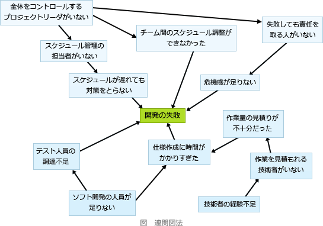

# [令和2年秋期 午前 問76](https://www.ap-siken.com/kakomon/02_aki/q76.html)

#問題 #ストラテジ #企業活動 #業務分析・データ利活用

解説を表示解説を隠す

<strong>問76</strong>　複雑な要因の絡む問題について，その因果関係を明らかにすることによって，問題の原因を究明する手法はどれか。

<ul class="ap-choices">
<li class="ap-choice-item ap-wrong">

ア　PDPC法

<a href="用語/PDPC" class="internal-link" data-href="用語/PDPC">PDPC</a>(Process Decision Program Chart)は、ある計画における目的達成のためにあらゆる事態を事前に想定し、計画の開始から最終結果に至る過程や手順を時間の推移に従って矢印で結合した図です。望ましい結果を得るための最適ルートを分析するために役立ちます。

</li>
<li class="ap-choice-item ap-wrong">

イ　クラスタ分析法

<a href="用語/クラスタ分析法" class="internal-link" data-href="用語/クラスタ分析法">クラスタ分析法</a>は、複数の変数(項目、属性、次元数)を持つデータ(多変量データ)を利用し、その変数間の相互の関係性をとらえるために使われる多変量解析の手法です。複数の異なる性質のものが混ざり合っている対象の中から、類似したものを集めてグルーピングするために使われます。

</li>
<li class="ap-choice-item ap-wrong">

ウ　系統図法

<a href="用語/系統図法" class="internal-link" data-href="用語/系統図法">系統図法</a>は、目的を達成する手段を見つけるときに、「目的－手段」の連鎖を段階的に下位に掘り下げていくことにより最適な手段を見いだす図法です。

</li>
<li class="ap-choice-item ap-correct">

エ　連関図法

正しい。<a href="用語/連関図法" class="internal-link" data-href="用語/連関図法">連関図法</a>は、複雑な要因の絡み合う事象について、その事象間の因果関係や相互関係を整理していくことで問題や原因を明らかにし、課題解決のための糸口を発見する手法です。中央に課題を置き、その周りに事象を置いていく作成方法が一般的です。<a href="用語/特性要因図" class="internal-link" data-href="用語/特性要因図">特性要因図</a>とは、要因同士の因果関係を表現できる点が異なっています。

</li>
</ul>

<h4>解説</h4>

正解は「エ」です。

