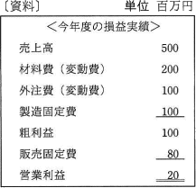

# [令和2年秋期 午前 問77](https://www.ap-siken.com/kakomon/02_aki/q77.html)

#問題 #ストラテジ #企業活動 #会計・財務

解説を表示解説を隠す

<strong>問77</strong>　資料は今年度の損益実績である。翌年度の計画では，営業利益を30百万円にしたい。翌年度の売上高は何百万円を計画すべきか。ここで，翌年度の固定費，変動費率は今年度と変わらないものとする。 

<ul class="ap-choices">
<li class="ap-choice-item ap-wrong">

ア　510

固定費180百万円と変動費率0.6を用いた営業利益の式から正しく求めると525百万円となるため、誤りです。

</li>
<li class="ap-choice-item ap-correct">

イ　525

正しい。固定費180百万円、変動費率0.6として「営業利益＝売上高－(売上高×0.6)－180」を立て、営業利益30百万円から売上高525百万円が求まります。

</li>
<li class="ap-choice-item ap-wrong">

ウ　550

固定費180百万円と変動費率0.6を用いた営業利益の式から正しく求めると525百万円となるため、誤りです。

</li>
<li class="ap-choice-item ap-wrong">

エ　575

固定費180百万円と変動費率0.6を用いた営業利益の式から正しく求めると525百万円となるため、誤りです。

</li>
</ul>

<h4>解説</h4>

正解は「イ」です。

この損益実績において、営業利益は「売上高－変動費－固定費」で求めることができます。変動費は売上高の増減によって増減する<a href="用語/費用" class="internal-link" data-href="用語/費用">費用</a>、固定費は売上高にかかわらず毎年一定の金額がかかる<a href="用語/費用" class="internal-link" data-href="用語/費用">費用</a>です。

まず、<a href="用語/費用" class="internal-link" data-href="用語/費用">費用</a>を変動費と固定費に分別し各金額を求めます（計算の過程で単位：百万円は省略しています）。

固定費 … 製造固定費100＋販売固定費80＝180 変動費 … 材料費200＋外注費100＝300

次に、変動費から変動費率（売上高に占める変動費の割合）を求めます。 変動費300÷売上高500＝0.6

変動費は売上高に対して一定の割合でかかる<a href="用語/費用" class="internal-link" data-href="用語/費用">費用</a>なので、変動費率を使用して「売上高×0.6」と表すことができます。

売上高をaとし、ここまで求めた数値を用いて以下の式で答えを計算します。 営業利益＝売上高－(売上高×0.6)－固定費 30＝a－0.6a－180 a－0.6a＝30＋180 0.4a＝210 a＝525

以上より、翌年度の営業利益を30百万円とするためには、525百万円の売上高を計画するべきであることがわかります。

