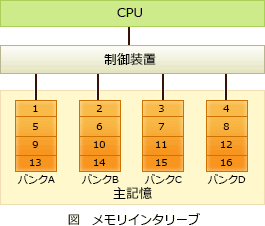

# [令和2年秋期 午前 問9](https://www.ap-siken.com/kakomon/02_aki/q9.html)

#問題 #テクノロジ #コンピュータ構成要素 #メモリ

解説を表示解説を隠す

<strong>問9</strong>　メモリインターリーブの説明はどれか。

<ul class="ap-choices">
<li class="ap-choice-item ap-wrong">

ア　CPUと磁気ディスク装置との間に半導体メモリによるデータバッファを設けて，磁気ディスクアクセスの高速化を図る。

これは<a href="用語/ディスクキャッシュ" class="internal-link" data-href="用語/ディスクキャッシュ">ディスクキャッシュ</a>の説明です。

</li>
<li class="ap-choice-item ap-wrong">

イ　主記憶のデータの一部をキャッシュメモリにコピーすることによって，CPUと主記憶とのアクセス速度のギャップを埋め，メモリアクセスの高速化を図る。

これは<a href="用語/キャッシュメモリ" class="internal-link" data-href="用語/キャッシュメモリ">キャッシュメモリ</a>の説明です。

</li>
<li class="ap-choice-item ap-wrong">

ウ　主記憶へのアクセスを高速化するため，アクセス要求，データの読み書き及び後処理が終わってから、次のメモリアクセスの処理に移る。

これは<a href="用語/排他制御" class="internal-link" data-href="用語/排他制御">排他制御</a>の説明です。

</li>
<li class="ap-choice-item ap-correct">

エ　主記憶を複数の独立したグループに分けて，各グループに交互にアクセスすることによって，主記憶へのアクセスの高速化を図る。

正しい。<a href="用語/メモリ" class="internal-link" data-href="用語/メモリ">メモリ</a>インターリーブの説明です。

</li>
</ul>

<h4>解説</h4>

<a href="用語/メモリ" class="internal-link" data-href="用語/メモリ">メモリ</a>インターリーブは、物理上はひとつである<a href="用語/主記憶" class="internal-link" data-href="用語/主記憶">主記憶</a>領域を、同時アクセス可能な複数の論理的な領域（バンク）に分け、それぞれのバンクに対してデータの読み書きを並列で行うことにより、<a href="用語/メモリ" class="internal-link" data-href="用語/メモリ">メモリ</a>アクセスの高速化を図る技術です。<a href="用語/メモリ" class="internal-link" data-href="用語/メモリ">メモリ</a>インターリーブでは、奇数アドレスはバンク1、偶数アドレスはバンク2というように、連続したアドレスを複数のバンクに割り振っていきます。通常は、連続するアドレスに次々とアクセスされることが多いため、見かけ上並列アクセスしているようになり、実効アクセス時間が短くなります。「<a href="用語/主記憶" class="internal-link" data-href="用語/主記憶">主記憶</a>に並列アクセス」ときたら<a href="用語/メモリ" class="internal-link" data-href="用語/メモリ">メモリ</a>インターリーブです。

